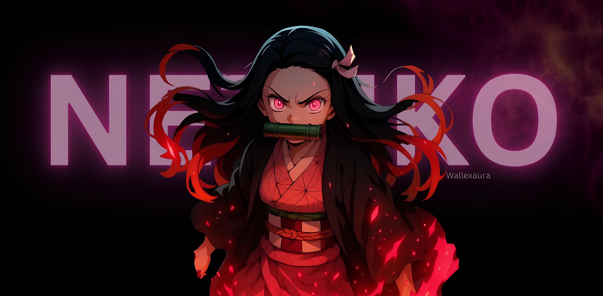

<div align="center">

<!-- BANNER -->


<br/>
<br/>

<!-- HERO SECTION -->

# 🌸 Nezuko

### The Ultimate All-In-One Telegram Bot Platform

**Production-ready • Multi-tenant • Async-first • Cloud-Native**

<br/>

<!-- BADGES - Row 1: Core Info -->

[](https://github.com/mohdakil2426/Nezuko-Telegram-Bot/releases)
[](https://www.python.org/)
[](https://nextjs.org/)
[](LICENSE)

<!-- BADGES - Row 2: Quality Metrics -->

[](https://pylint.org/)
[](https://pyrefly.org/)
[](tests/)
[](https://github.com/mohdakil2426/Nezuko-Telegram-Bot)

<!-- BADGES - Row 3: Tech Stack -->

[](https://react.dev/)
[](https://insforge.app)
[](https://python-telegram-bot.org/)
[](https://vercel.com)

<br/>

<!-- QUICK LINKS -->

[**📖 Documentation**](docs/README.md) • [**🏗️ Architecture**](docs/architecture/README.md) • [**☁️ Cloud Deployment**](#-cloud-deployment) • [**🤝 Contributing**](docs/contributing/README.md)

<br/>

</div>

---

<!-- TABLE OF CONTENTS -->
<details open>
<summary><h2>📑 Table of Contents</h2></summary>

- [✨ What is Nezuko?](#-what-is-nezuko)
- [🎯 Key Features](#-key-features)
- [☁️ Cloud Deployment](#-cloud-deployment)
- [🚀 Local Development](#-local-development)
- [🏗️ Project Structure](#️-project-structure)
- [💻 Tech Stack](#-tech-stack)
- [🎨 Dashboard Preview](#-dashboard-preview)
- [🔧 Bot Commands](#-bot-commands)
- [🤝 Contributing](#-contributing)
- [📄 License](#-license)

</details>

---

## ✨ What is Nezuko?

**Nezuko** is a complete **Telegram bot ecosystem** for automated channel membership enforcement. It features a modern 2-tier architecture (Web + Bot) powered by InsForge Backend-as-a-Service.

```
┌─────────────────────────────────────────────────────────────────────────┐
│                          NEZUKO CLOUD STACK                             │
├─────────────────────┬─────────────────────┬─────────────────────────────┤
│      apps/web       │      InsForge       │        apps/bot             │
│   ┌─────────────┐   │   ┌─────────────┐   │    ┌─────────────┐          │
│   │  Next.js 16 │   │   │ PostgreSQL  │   │    │     PTB     │          │
│   │  React 19   │◄──┼──►│  Realtime   │◄──┼──► │   v22.6+    │          │
│   │  Dashboard  │   │   │  Storage    │   │    │   AsyncIO   │          │
│   └─────────────┘   │   └─────────────┘   │    └─────────────┘          │
│     (Vercel)        │      (BaaS)         │       (Koyeb)               │
└─────────────────────┴─────────────────────┴─────────────────────────────┘
```

<br/>

## 🎯 Key Features

<table>
<tr>
<td width="50%">

### 🔐 Channel Membership Enforcement

Automatically ensure users join required channels before participating in groups.

- **Instant Join Protection** — Mutes users the moment they join
- **Real-time Leave Detection** — Revokes access immediately
- **Multi-Channel Support** — Require multiple channels
- **One-Click Verification** — Self-service inline buttons

</td>
<td width="50%">

### 📊 Admin Dashboard

A beautiful, responsive web interface for complete control.

- **26 shadcn/ui Components** — Clean, professional design
- **Real-time Analytics** — Live stats via WebSockets
- **Bot Management** — Add/Remove/Restart bots remotely
- **Light/Dark/System Themes** — Automatic theme detection

</td>
</tr>
<tr>
<td width="50%">

### ⚡ Enterprise Performance

Built for scale with production-ready architecture.

- **Sub-100ms Latency** — Optimized async verification
- **Stateless Bot Engine** — Horizontal scaling ready
- **Edge Functions** — Serverless logic for heavy lifting
- **Rate Limiting** — Built-in Telegram API protection

</td>
<td width="50%">

### 🛠️ Self-Service Admin Commands

Empower group admins with simple commands.

- `/protect @Channel` — Enable protection instantly
- `/status` — View real-time protection status
- `/unprotect` — Disable protection cleanly
- `/settings` — Configure verification behavior

</td>
</tr>
</table>

<br/>

## ☁️ Cloud Deployment

Nezuko is designed to run in the cloud with **zero cost** using free tiers.

### 1. Dashboard (Vercel)
The web dashboard manages your bots, analytics, and configuration.
- **Platform:** Vercel (Free)
- **Setup:** Import repository -> Select `apps/web` as root -> Deploy.

### 2. Bot Engine (Koyeb)
The Python bot engine runs 24/7 to handle Telegram updates.
- **Platform:** Koyeb (Free)
- **Setup:** Connect GitHub -> Select Dockerfile (`config/docker/Dockerfile.monorepo`) -> Deploy.

### 3. Backend (InsForge)
Managed database, authentication, and realtime features.
- **Platform:** InsForge (Free)
- **Setup:** Create project -> Apply migrations -> Connect.

See [**DEPLOYMENT-REPORT.md**](DEPLOYMENT-REPORT.md) for the detailed setup guide.

<br/>

## 🚀 Local Development

### Prerequisites

| Requirement | Version | Notes |
| :--- | :--- | :--- |
| **Python** | 3.13+ | Required for bot |
| **Node.js** | 20+ | Required for dashboard |
| **Bun** | 1.3+ | Recommended (faster than npm) |
| **InsForge** | Cloud | Managed Backend (Free) |

### Quick Start

```bash
# Clone the repository
git clone https://github.com/mohdakil2426/Nezuko-Telegram-Bot.git
cd Nezuko-Telegram-Bot

# Install dependencies
bun install
python -m venv .venv
source .venv/bin/activate  # or .\.venv\Scripts\activate on Windows
pip install -r requirements.txt

# Configure Environment
cp apps/web/.env.example apps/web/.env.local
cp apps/bot/.env.example apps/bot/.env

# Run Services
# Terminal 1: Web Dashboard
cd apps/web && bun dev

# Terminal 2: Telegram Bot
python -m apps.bot.main
```

<br/>

## 🏗️ Project Structure

```
nezuko-monorepo/
├── 📁 apps/
│   ├── 🌐 web/                 # Next.js 16 Admin Dashboard
│   │   ├── src/app/            # App Router pages
│   │   ├── src/components/     # shadcn/ui + custom components
│   │   └── src/lib/            # Hooks, InsForge SDK
│   │
│   └── 🤖 bot/                 # Telegram Bot Engine
│       ├── handlers/           # Command & event handlers
│       ├── core/               # Database, lifecycle manager
│       └── services/           # Business logic
│
├── ☁️ insforge/                # Backend Configuration
│   ├── migrations/             # Database schema
│   └── functions/              # Edge Functions
│
├── 📦 packages/                # Shared packages
├── 🐳 config/                  # Docker & Deployment configs
└── 📚 docs/                    # Documentation
```

<br/>

## 💻 Tech Stack

<div align="center">

### Frontend


### Backend & Bot


</div>

<br/>

## 🎨 Dashboard Preview

The admin dashboard is built with **pure shadcn/ui** components for maintainability and a professional look. Toggle between mock data and real API with `NEXT_PUBLIC_USE_MOCK=true` in `.env.local`.

<br/>

## 🔧 Bot Commands

| Command | Context | Permission | Description |
| :--- | :--- | :--- | :--- |
| `/start` | Private | Anyone | Welcome message with setup guide |
| `/help` | Any | Anyone | Command reference |
| `/protect @Channel` | Group | Admin | Enable channel enforcement |
| `/status` | Group | Anyone | View protection status |
| `/settings` | Group | Admin | View/modify configuration |

<br/>

## 🤝 Contributing

Contributions are welcome! Please read our [Contributing Guide](docs/contributing/README.md) for details.

<br/>

## 📄 License

Distributed under the **MIT License**. See [LICENSE](LICENSE) for more information.

<br/>

---

<div align="center">

### Built with 💜 using async Python & modern React

[](https://github.com/mohdakil2426/Nezuko-Telegram-Bot/stargazers)

</div>
