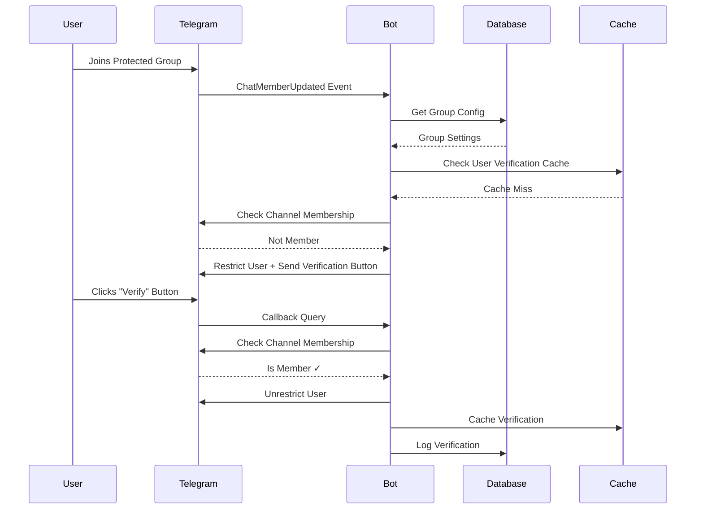
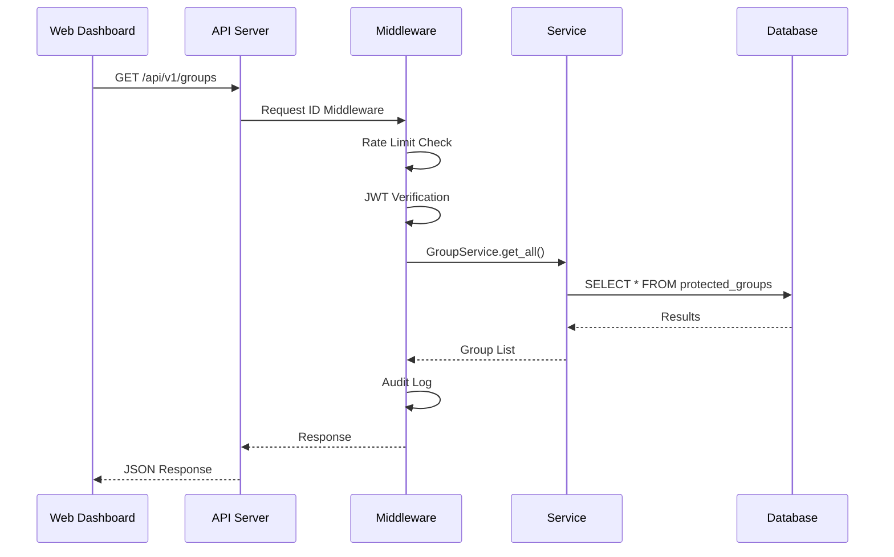
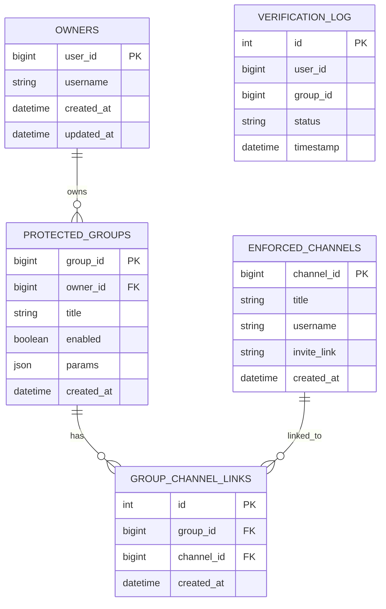
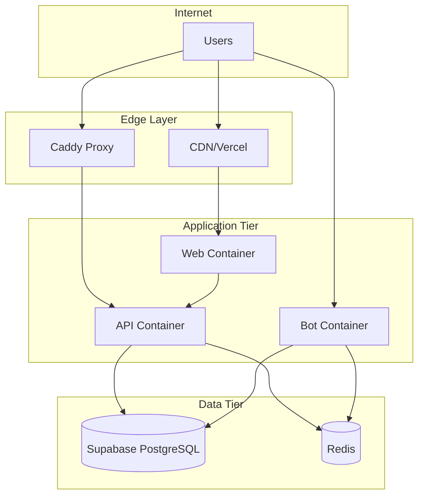

# 🏗️ Architecture Overview

> **System design, data flow, and component architecture for Nezuko**

This document provides a comprehensive overview of the Nezuko architecture, designed for developers who want to understand how the system works and how to extend it.

---

## 📋 Table of Contents

1. [System Overview](#system-overview)
2. [Component Architecture](#component-architecture)
3. [Data Flow](#data-flow)
4. [Technology Stack](#technology-stack)
5. [Folder Structure](#folder-structure)
6. [Diagrams](#diagrams)

---

## System Overview

Nezuko is a **production-ready, multi-tenant Telegram bot platform** consisting of three main components:

```
┌─────────────────────────────────────────────────────────────────────────────┐
│                              NEZUKO PLATFORM                                 │
├─────────────────┬──────────────────────┬────────────────────────────────────┤
│                 │                      │                                    │
│   apps/web      │     apps/api         │          apps/bot                  │
│   (Next.js 16)  │     (FastAPI)        │     (python-telegram-bot)          │
│                 │                      │                                    │
│   ┌─────────┐   │   ┌────────────┐     │   ┌──────────────────────┐         │
│   │ Admin   │   │   │ REST API   │     │   │ Telegram Bot Engine  │         │
│   │ Panel   │──────▶│ Server     │     │   │                      │         │
│   └─────────┘   │   └────────────┘     │   │ • Join Protection    │         │
│                 │         │            │   │ • Channel Verify     │         │
│   • Dashboard   │         │            │   │ • User Management    │         │
│   • Groups CRUD │         ▼            │   └──────────────────────┘         │
│   • Channels    │   ┌────────────┐     │            │                       │
│   • Analytics   │   │ Services   │     │            ▼                       │
│   • Real-time   │   └────────────┘     │   ┌──────────────────────┐         │
│     Logs        │         │            │   │ Database Layer       │         │
│                 │         ▼            │   │ (SQLAlchemy Async)   │         │
│                 │   ┌────────────┐     │   └──────────────────────┘         │
│                 │   │ PostgreSQL │◀────│────────────┘                       │
│                 │   │ (Supabase) │     │                                    │
│                 │   └────────────┘     │                                    │
└─────────────────┴──────────────────────┴────────────────────────────────────┘
                              │
                              ▼
                    ┌──────────────────┐
                    │  External APIs   │
                    │  • Telegram API  │
                    │  • Supabase Auth │
                    │  • Redis Cache   │
                    │  • Sentry        │
                    └──────────────────┘
```

---

## Component Architecture

### 1. Web Dashboard (`apps/web`)

**Purpose**: Admin panel for managing protected groups and monitoring bot activity.

```
apps/web/
├── src/
│   ├── app/                    # Next.js App Router
│   │   ├── (auth)/             # Auth routes (login, forgot-password)
│   │   ├── dashboard/          # Protected dashboard routes
│   │   │   ├── groups/         # Groups management
│   │   │   ├── channels/       # Channels management
│   │   │   ├── analytics/      # Analytics dashboard
│   │   │   ├── logs/           # Real-time log viewer
│   │   │   └── database/       # Database browser
│   │   ├── layout.tsx          # Root layout
│   │   └── globals.css         # Tailwind v4 styles
│   │
│   ├── components/             # UI Components
│   │   ├── ui/                 # shadcn/ui primitives
│   │   ├── layout/             # Layout components
│   │   ├── dashboard/          # Dashboard-specific
│   │   ├── groups/             # Groups components
│   │   ├── channels/           # Channels components
│   │   └── logs/               # Log viewer components
│   │
│   ├── lib/                    # Utilities
│   │   ├── api/                # API client functions
│   │   ├── hooks/              # Custom React hooks
│   │   └── supabase/           # Supabase client config
│   │
│   ├── providers/              # React Context providers
│   ├── stores/                 # Zustand state stores
│   └── proxy.ts                # Next.js 16 auth middleware
```

**Key Technologies**:
- **Framework**: Next.js 16 (App Router)
- **Styling**: Tailwind CSS v4, shadcn/ui
- **State**: TanStack Query v5, Zustand
- **Auth**: Supabase SSR

### 2. REST API (`apps/api`)

**Purpose**: Backend services for the admin panel and external integrations.

```
apps/api/
├── src/
│   ├── api/
│   │   └── v1/
│   │       ├── endpoints/      # API route handlers
│   │       │   ├── auth.py     # Authentication
│   │       │   ├── groups.py   # Groups CRUD
│   │       │   ├── channels.py # Channels CRUD
│   │       │   ├── dashboard.py # Dashboard stats
│   │       │   ├── analytics.py # Analytics data
│   │       │   ├── database.py  # DB browser
│   │       │   ├── logs.py      # Log retrieval
│   │       │   └── websocket.py # WebSocket logs
│   │       └── router.py       # Route registration
│   │
│   ├── core/                   # Core infrastructure
│   │   ├── config.py           # Settings (Pydantic)
│   │   ├── database.py         # AsyncSession factory
│   │   ├── security.py         # JWT verification
│   │   └── websocket.py        # WebSocket manager
│   │
│   ├── middleware/             # HTTP middleware
│   │   ├── audit.py            # Audit logging
│   │   ├── logging.py          # Request logging
│   │   ├── rate_limit.py       # Rate limiting
│   │   └── request_id.py       # Trace ID injection
│   │
│   ├── models/                 # SQLAlchemy models
│   ├── schemas/                # Pydantic schemas
│   └── services/               # Business logic
│
└── main.py                     # FastAPI app entry
```

**Key Technologies**:
- **Framework**: FastAPI 0.128+
- **ORM**: SQLAlchemy 2.0 Async
- **Validation**: Pydantic v2
- **Auth**: Supabase JWT verification

### 3. Telegram Bot (`apps/bot`)

**Purpose**: Core verification engine that enforces channel membership.

```
apps/bot/
├── main.py                     # Entry point
├── config.py                   # Environment configuration
│
├── core/                       # Infrastructure
│   ├── database.py             # Async SQLAlchemy engine
│   ├── cache.py                # Redis caching layer
│   └── rate_limiter.py         # Request throttling
│
├── database/                   # Data layer
│   ├── models.py               # ORM models
│   ├── crud.py                 # CRUD operations
│   ├── migrations/             # Alembic migrations
│   └── verification_logger.py  # Verification audit
│
├── handlers/                   # Telegram handlers
│   ├── admin/                  # Admin commands
│   │   ├── protect.py          # /protect command
│   │   ├── unprotect.py        # /unprotect command
│   │   └── settings.py         # /settings command
│   │
│   ├── events/                 # Event handlers
│   │   ├── join.py             # Member join events
│   │   ├── left.py             # Channel leave events
│   │   └── message.py          # Message filtering
│   │
│   └── verify.py               # Verification callback
│
├── services/                   # Business logic
│   ├── verification.py         # Core verification logic
│   └── protection.py           # Protection management
│
└── utils/                      # Utilities
    ├── metrics.py              # Prometheus metrics
    ├── health.py               # Health endpoints
    └── logging.py              # Structured logging
```

**Key Technologies**:
- **Framework**: python-telegram-bot v22.6
- **Async**: Full asyncio support
- **Cache**: Redis with graceful fallback
- **Metrics**: Prometheus client

---

## Data Flow

### Verification Flow



### API Request Flow



---

## Technology Stack

### Frontend (Web Dashboard)

| Category | Technology | Version |
|----------|------------|---------|
| Framework | Next.js | 16.1.4 |
| Runtime | React | 19.2.3 |
| Language | TypeScript | 5.9.3 |
| Styling | Tailwind CSS | 4.1.18 |
| Components | shadcn/ui | Latest |
| State | TanStack Query | 5.90.20 |
| State | Zustand | 5.0.10 |
| Forms | React Hook Form | 7.71.1 |
| Validation | Zod | 4.3.6 |
| Charts | Recharts | 3.7.0 |

### Backend (API)

| Category | Technology | Version |
|----------|------------|---------|
| Framework | FastAPI | 0.128+ |
| Language | Python | 3.13.1 |
| ORM | SQLAlchemy | 2.0.46 |
| Validation | Pydantic V2 | 2.12.5 |
| Auth | PyJWT | 2.10.1 |
| Logging | Structlog | 25.5.0 |
| Monitoring | Sentry SDK | 2.50.0 |

### Bot Engine

| Category | Technology | Version |
|----------|------------|---------|
| Library | python-telegram-bot | 22.6+ |
| Language | Python | 3.13.1 |
| Cache | Redis | 7.1.0+ |
| Metrics | Prometheus Client | 0.24.1 |
| HTTP | HTTPX | 0.28.1 |

### Infrastructure

| Category | Technology |
|----------|------------|
| Database | PostgreSQL 16+ (Supabase) |
| Cache | Redis 7.1+ |
| Auth | Supabase Auth |
| Containerization | Docker |
| Orchestration | Docker Compose |
| CI/CD | GitHub Actions |

---

## Folder Structure

```
nezuko-monorepo/
│
├── apps/                       # All applications
│   ├── web/                    # Next.js Admin Dashboard
│   ├── api/                    # FastAPI REST Backend
│   └── bot/                    # Telegram Bot Engine
│
├── packages/                   # Shared code
│   ├── types/                  # @nezuko/types (Zod schemas)
│   └── config/                 # Shared configs
│
├── config/                     # Infrastructure
│   └── docker/                 # Docker files
│       ├── docker-compose.yml
│       ├── Dockerfile.web
│       ├── Dockerfile.api
│       └── Dockerfile.monorepo
│
├── scripts/                    # Utility scripts
│   ├── setup/                  # One-time setup
│   ├── deploy/                 # Deployment
│   └── maintenance/            # Utilities
│
├── storage/                    # Runtime files (GITIGNORED)
│   ├── logs/                   # Application logs
│   ├── data/                   # Local databases
│   └── uploads/                # User uploads
│
├── docs/                       # Documentation
└── tests/                      # Test suites
```

---

## Diagrams

### High-Level Architecture

```mermaid
graph TB
    subgraph "Client Layer"
        TG[Telegram Users]
        WEB[Admin Dashboard]
    end

    subgraph "Application Layer"
        BOT[Bot Engine]
        API[REST API]
    end

    subgraph "Data Layer"
        PG[(PostgreSQL)]
        REDIS[(Redis Cache)]
    end

    subgraph "External Services"
        TGAPI[Telegram API]
        SUPA[Supabase Auth]
        SENTRY[Sentry]
    end

    TG --> TGAPI --> BOT
    WEB --> API
    BOT --> PG
    BOT --> REDIS
    API --> PG
    API --> SUPA
    BOT --> SENTRY
    API --> SENTRY
```



### Database Schema



### Deployment Architecture



---

## Related Documentation

- [**Folder Structure**](./folder-structure.md) - Complete project organization
- [**Diagrams**](./diagrams.md) - All architecture diagrams in one place
- [**API Reference**](../api/README.md) - REST API documentation
- [**Bot Reference**](../bot/README.md) - Telegram bot guide
- [**Database**](../database/README.md) - Database schema and models

---

*See also: [Tech Stack](./tech-stack.md)*
