# 📊 Architecture Diagrams

> **Visual representations of Nezuko's system architecture**

This document contains all the Mermaid diagrams used throughout the documentation, organized by category.

---

## 📋 Table of Contents

1. [System Overview](#system-overview)
2. [Data Flow Diagrams](#data-flow-diagrams)
3. [Database Schema](#database-schema)
4. [Component Architecture](#component-architecture)
5. [Deployment Architecture](#deployment-architecture)
6. [Authentication Flow](#authentication-flow)

---

## System Overview

### High-Level Architecture

```mermaid
graph TB
    subgraph "Client Layer"
        TELEGRAM["📱 Telegram Users"]
        BROWSER["🌐 Admin Dashboard"]
    end

    subgraph "Application Layer"
        BOT["🤖 Bot Engine<br/>(Python)"]
        API["⚡ REST API<br/>(FastAPI)"]
        WEB["🖥️ Web App<br/>(Next.js)"]
    end

    subgraph "Data Layer"
        PG[("🐘 PostgreSQL<br/>(Supabase)")]
        REDIS[("⚡ Redis<br/>Cache")]
    end

    subgraph "External Services"
        TG_API["Telegram API"]
        SUPA["Supabase Auth"]
        SENTRY["Sentry"]
    end

    TELEGRAM --> TG_API --> BOT
    BROWSER --> WEB --> API
    
    BOT --> PG
    BOT --> REDIS
    BOT --> SENTRY
    
    API --> PG
    API --> REDIS
    API --> SUPA
    API --> SENTRY
    
    WEB --> SUPA

    style BOT fill:#3b82f6,color:#fff
    style API fill:#10b981,color:#fff
    style WEB fill:#8b5cf6,color:#fff
    style PG fill:#0ea5e9,color:#fff
    style REDIS fill:#ef4444,color:#fff
```



### Monorepo Structure

```mermaid
graph LR
    subgraph "nezuko-monorepo"
        direction TB
        
        subgraph "apps/"
            WEB["📱 web<br/>Next.js 16"]
            API["⚙️ api<br/>FastAPI"]
            BOT["🤖 bot<br/>PTB v22"]
        end
        
        subgraph "packages/"
            TYPES["📦 types<br/>Zod + TS"]
            CONFIG["📦 config<br/>ESLint/TS"]
        end
        
        subgraph "config/"
            DOCKER["🐳 docker/"]
        end
        
        subgraph "storage/"
            LOGS["📄 logs/"]
            DATA["💾 data/"]
        end
    end
    
    WEB --> TYPES
    API --> TYPES
    WEB --> CONFIG

    style WEB fill:#8b5cf6
    style API fill:#10b981
    style BOT fill:#3b82f6
```



---

## Data Flow Diagrams

### User Verification Flow

```mermaid
sequenceDiagram
    autonumber
    
    participant U as 👤 User
    participant T as 📱 Telegram
    participant B as 🤖 Bot
    participant C as ⚡ Cache
    participant D as 🗄️ Database

    Note over U,D: Phase 1: User Joins Protected Group
    
    U->>T: Joins Group
    T->>B: ChatMemberUpdated Event
    
    B->>D: Get Group Config
    D-->>B: Config (enabled, channels)
    
    alt Protection Enabled
        B->>T: Restrict User (Mute)
        B->>T: Send Verification Button
    else Protection Disabled
        Note over B: No action needed
    end
    
    Note over U,D: Phase 2: User Clicks Verify
    
    U->>T: Click "✅ Verify" Button
    T->>B: CallbackQuery
    
    B->>B: Validate User ID
    B->>C: Check Cache
    
    alt Cache Hit
        C-->>B: User Verified ✓
        B->>T: Unrestrict User
    else Cache Miss
        loop For Each Required Channel
            B->>T: Check Membership
            T-->>B: Member Status
        end
        
        alt All Channels Joined
            B->>T: Unrestrict User
            B->>C: Cache Verification
            B->>D: Log Verification
            B->>T: "✅ Verified!"
        else Missing Channels
            B->>T: "Join all channels first!"
        end
    end
```



### API Request Flow

```mermaid
sequenceDiagram
    autonumber
    
    participant W as 🌐 Web Dashboard
    participant P as 🔐 Proxy
    participant A as ⚡ API Server
    participant M as 🛡️ Middleware Stack
    participant S as 📊 Service Layer
    participant D as 🗄️ Database

    W->>P: GET /dashboard/groups
    P->>P: Validate Session Cookie
    P->>A: Forward Request + JWT
    
    A->>M: Request ID Middleware
    Note over M: Add X-Request-ID header
    
    M->>M: Rate Limit Check
    alt Rate Limit Exceeded
        M-->>A: 429 Too Many Requests
    end
    
    M->>M: JWT Verification
    alt Invalid Token
        M-->>A: 401 Unauthorized
    end
    
    M->>S: GroupService.get_all()
    S->>D: SELECT * FROM protected_groups
    D-->>S: Results
    
    S-->>M: Groups List
    M->>M: Audit Log Entry
    M-->>A: JSON Response
    A-->>W: { groups: [...] }
```



### WebSocket Log Streaming

```mermaid
sequenceDiagram
    participant W as 🌐 Web Client
    participant A as ⚡ API Server
    participant WS as 📡 WebSocket Manager
    participant L as 📝 Logger
    participant B as 🤖 Bot

    W->>A: ws://api/ws/logs?token=xxx
    A->>A: Validate JWT Token
    A->>WS: Register Connection
    WS-->>W: Connection Accepted
    
    loop Real-time Logs
        B->>L: Log Event (verification, error, etc)
        L->>WS: Broadcast to Clients
        WS-->>W: { type: "log", data: {...} }
    end
    
    loop Heartbeat (30s)
        WS-->>W: { type: "heartbeat" }
    end
    
    W->>WS: { action: "filter", level: "ERROR" }
    WS-->>W: { type: "filter_updated" }
    
    W->>A: Disconnect
    WS->>WS: Cleanup Connection
```



---

## Database Schema

### Bot Database ERD


### Admin Database ERD


---

## Component Architecture

### Bot Handler Architecture


### Web Component Hierarchy


---

## Deployment Architecture

### Production Deployment

```mermaid
graph TB
    subgraph "Internet"
        USERS["👥 Users"]
    end

    subgraph "Edge (Cloudflare/Vercel)"
        CDN["🌐 CDN<br/>Static Assets"]
        DNS["🔗 DNS"]
    end

    subgraph "Compute Layer"
        subgraph "Web Tier"
            WEB1["📱 Web Container 1"]
            WEB2["📱 Web Container 2"]
        end
        
        subgraph "API Tier"
            API1["⚡ API Container 1"]
            API2["⚡ API Container 2"]
            API3["⚡ API Container 3"]
        end
        
        subgraph "Bot Tier"
            BOT["🤖 Bot Container"]
        end

        LB["⚖️ Load Balancer<br/>(Caddy)"]
    end

    subgraph "Data Layer (Managed)"
        SUPABASE[("🐘 Supabase<br/>PostgreSQL + Auth + RT")]
        REDIS_CLOUD[("⚡ Redis Cloud")]
    end

    subgraph "Observability"
        SENTRY["🐛 Sentry"]
        PROMETHEUS["📊 Prometheus"]
        GRAFANA["📈 Grafana"]
    end

    USERS --> DNS --> CDN
    CDN --> LB
    LB --> WEB1 & WEB2
    LB --> API1 & API2 & API3
    
    WEB1 & WEB2 --> API1
    API1 & API2 & API3 --> SUPABASE
    API1 & API2 & API3 --> REDIS_CLOUD
    
    BOT --> SUPABASE
    BOT --> REDIS_CLOUD
    
    API1 & BOT --> SENTRY
    API1 & BOT --> PROMETHEUS
    PROMETHEUS --> GRAFANA

    style LB fill:#f59e0b
    style SUPABASE fill:#10b981
    style REDIS_CLOUD fill:#ef4444
```



### Docker Compose Setup


---

## Authentication Flow

### Supabase Auth with Next.js 16


### API JWT Verification

```mermaid
graph TB
    subgraph "Request"
        REQ["Incoming Request<br/>Authorization: Bearer xxx"]
    end

    subgraph "Verification"
        EXTRACT["Extract Token"]
        DECODE["JWT Decode"]
        VERIFY["Verify Signature"]
        CHECK_EXP["Check Expiration"]
        CHECK_AUD["Check Audience"]
    end

    subgraph "Result"
        SUCCESS["✅ Authenticated<br/>Return user_id"]
        FAIL["❌ 401 Unauthorized"]
    end

    REQ --> EXTRACT
    EXTRACT --> DECODE
    DECODE -->|Valid| VERIFY
    DECODE -->|Invalid| FAIL
    VERIFY -->|Valid| CHECK_EXP
    VERIFY -->|Invalid| FAIL
    CHECK_EXP -->|Valid| CHECK_AUD
    CHECK_EXP -->|Expired| FAIL
    CHECK_AUD -->|Valid| SUCCESS
    CHECK_AUD -->|Invalid| FAIL

    style SUCCESS fill:#10b981,color:#fff
    style FAIL fill:#ef4444,color:#fff
```



---

## Usage

### Embedding in Markdown

To use these diagrams in other documentation:

1. **Copy the Mermaid code block**
2. **Paste into any Markdown file**
3. **GitHub/GitLab/VSCode** will render automatically

### Generating Images

For platforms that don't support Mermaid:

```bash
# Using mermaid-cli
npm install -g @mermaid-js/mermaid-cli

# Generate PNG
mmdc -i diagrams.md -o diagram.png -t dark

# Generate SVG
mmdc -i diagrams.md -o diagram.svg
```

### Live Editor

Edit diagrams interactively at:
- [Mermaid Live Editor](https://mermaid.live/)

---

*These diagrams are maintained in sync with the codebase.*
