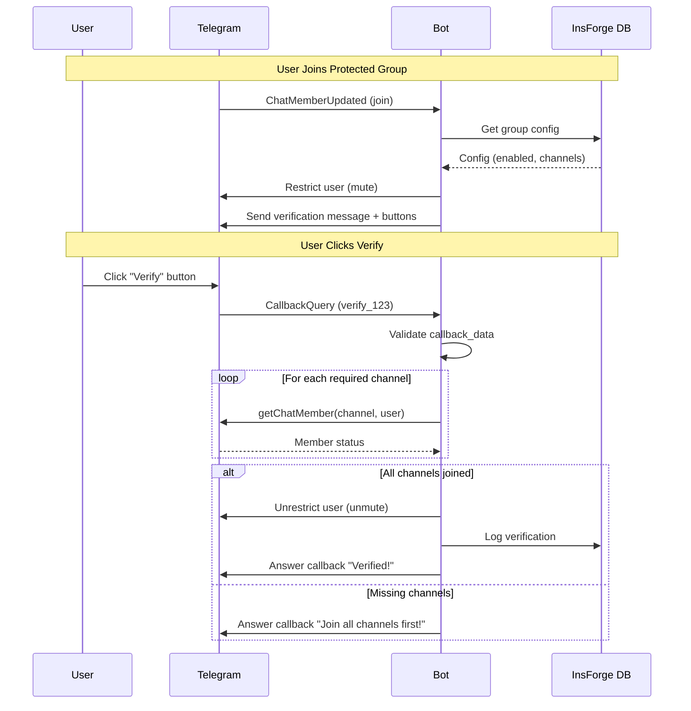

# 🤖 Bot Reference

> **Complete documentation for the Nezuko Telegram Bot**

The Nezuko bot enforces channel membership in Telegram groups. When enabled, users must join specified channels before they can send messages in the protected group.

---

## 📋 Table of Contents

1. [Overview](#overview)
2. [Setup](#setup)
3. [Commands](#commands)
4. [Event Handlers](#event-handlers)
5. [Verification Flow](#verification-flow)
6. [Configuration](#configuration)

---

## Overview

### Core Features

| Feature | Description |
|---------|-------------|
| **Channel Enforcement** | Require users to join channels before chatting |
| **Multi-Channel Support** | Require multiple channels (AND logic) |
| **Instant Mute** | Automatically mute on join |
| **One-Click Verify** | Inline button for self-service verification |
| **Leave Detection** | Re-restrict users who leave required channels |
| **Admin Dashboard** | Web-based management interface |

### How It Works

```
┌─────────────────────────────────────────────────────────────────┐
│                    VERIFICATION FLOW                             │
├──────────────────────────────────────────────────────────────────┤
│                                                                  │
│  1. User joins    2. Bot mutes     3. Bot sends     4. User     │
│     protected        user            verification      clicks   │
│     group            immediately     button            button   │
│                                                                  │
│       👤              🔇               🔇               ✅        │
│       │               │                │               │        │
│       ▼               ▼                ▼               ▼        │
│  ┌─────────┐    ┌─────────┐     ┌─────────────┐  ┌──────────┐  │
│  │ Telegram │───▶│   Bot   │────▶│  Verify Me  │──▶│  Check   │  │
│  │  Event   │    │ Handler │     │   Button    │   │ Channels │  │
│  └─────────┘    └─────────┘     └─────────────┘  └──────────┘  │
│                                                        │        │
│                     5. If member of all channels:      ▼        │
│                                                  ┌──────────┐   │
│                                                  │  Unmute  │   │
│                                                  │   User   │   │
│                                                  └──────────┘   │
└─────────────────────────────────────────────────────────────────┘
```

---

## Setup

### Prerequisites

1. **Create bot** via [@BotFather](https://t.me/BotFather)
2. **Get bot token** from BotFather
3. **Add bot to group** as Administrator with "Restrict Members" permission
4. **Add bot to channel** as Administrator

### Quick Setup

```bash
# 1. Configure environment
cp apps/bot/.env.example apps/bot/.env
# Edit apps/bot/.env with your BOT_TOKEN and INSFORGE credentials

# 2. Run the bot
cd apps/bot
python -m main
```

### Setup in Telegram

1. **Add bot to your GROUP** as Admin
   - Grant "Restrict Members" permission

2. **Add bot to your CHANNEL** as Admin
   - No special permissions needed

3. **Enable protection** in the group:
   ```
   /protect @YourChannel
   ```

4. **Done!** New members must now join the channel to chat.

---

## Commands

### User Commands

| Command | Context | Description |
|---------|---------|-------------|
| `/start` | Private | Welcome message with setup guide |
| `/help` | Any | Show help and command list |
| `/status` | Group | Show protection status for the group |

### Admin Commands

| Command | Context | Required Permission | Description |
|---------|---------|---------------------|-------------|
| `/protect @channel` | Group | Admin | Enable protection with specified channel |
| `/unprotect` | Group | Admin | Disable protection |
| `/settings` | Group | Admin | View/modify group settings |

### Superadmin Commands

| Command | Description |
|---------|-------------|
| `/stats` | Global bot statistics |
| `/broadcast` | Broadcast message to all groups |

---

## Event Handlers

### `ChatMemberUpdated` - Join Handler

Triggered when a user joins a protected group.

```python
# apps/bot/handlers/events/join.py

async def on_chat_member_updated(update: Update, context: CallbackContext):
    """Handle new member joins."""

    # 1. Check if group is protected (via InsForge)
    group = await get_protected_group(chat_id)
    if not group or not group.enabled:
        return

    # 2. Get required channels
    channels = await get_enforced_channels(chat_id)

    # 3. Restrict the user
    await context.bot.restrict_chat_member(
        chat_id=chat_id,
        user_id=user_id,
        permissions=ChatPermissions(can_send_messages=False)
    )

    # 4. Send verification button
    await context.bot.send_message(
        chat_id=chat_id,
        text=f"Welcome {user.mention}! Please join our channels and verify.",
        reply_markup=InlineKeyboardMarkup([
            [InlineKeyboardButton("📢 Join Channel", url=channel.invite_link)],
            [InlineKeyboardButton("✅ Verify", callback_data=f"verify_{user_id}")]
        ])
    )
```

### `CallbackQuery` - Verify Handler

Triggered when user clicks the "Verify" button.

```python
# apps/bot/handlers/verify.py

async def on_verify_callback(update: Update, context: CallbackContext):
    """Handle verification button click."""

    query = update.callback_query
    user_id = int(query.data.split("_")[1])

    # Security: Ensure user is clicking their own button
    if query.from_user.id != user_id:
        await query.answer("This button is not for you!", show_alert=True)
        return

    # Check membership in all required channels
    for channel in channels:
        member = await context.bot.get_chat_member(channel.channel_id, user_id)
        if member.status in ("left", "kicked"):
            await query.answer("You haven't joined all channels!", show_alert=True)
            return

    # Unrestrict the user
    await context.bot.restrict_chat_member(
        chat_id=chat_id,
        user_id=user_id,
        permissions=ChatPermissions(can_send_messages=True, ...)
    )

    await query.answer("✅ Verified! You can now chat.")
```

---

## Verification Flow

### Sequence Diagram



---

## Configuration

### Environment Variables

```bash
# apps/bot/.env

# Required
BOT_TOKEN=your_telegram_bot_token

# InsForge
INSFORGE_URL=https://your-app.region.insforge.app
INSFORGE_SERVICE_KEY=your_service_role_key

# Settings
ENVIRONMENT=development  # or production
LOG_LEVEL=INFO          # DEBUG, INFO, WARNING, ERROR

# Webhook Mode (Production)
WEBHOOK_URL=https://your-domain.com/webhook
WEBHOOK_SECRET=your_secret_token
PORT=8000
```

---

## Related Documentation

- [**Web Dashboard**](../web/README.md) - Admin panel guide
- [**Architecture**](../architecture/README.md) - System design overview
- [**Database**](../database/README.md) - Database schema and models
