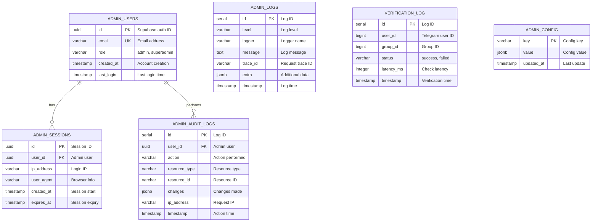

# 🗄️ Database Documentation

> **Schema, models, migrations, and data architecture for Nezuko**

This document covers the complete database architecture, including SQLAlchemy models, relationships, migrations, and best practices.

---

## 📋 Table of Contents

1. [Overview](#overview)
2. [Entity Relationship Diagram](#entity-relationship-diagram)
3. [Tables & Models](#tables--models)
4. [Migrations](#migrations)
5. [Connection Management](#connection-management)
6. [Query Patterns](#query-patterns)

---

## Overview

Nezuko uses **PostgreSQL** (via Supabase) with **SQLAlchemy 2.0 async** for database operations.

### Database Split

| Domain | App | Purpose |
|--------|-----|---------|
| **Bot Database** | `apps/bot` | Core bot data (groups, channels, links) |
| **Admin Database** | `apps/api` | Admin panel data (users, sessions, audit logs) |

Both databases share the same PostgreSQL instance but use separate tables.

### Technology Stack

| Component | Technology |
|-----------|------------|
| Database | PostgreSQL 16+ (Supabase) |
| ORM | SQLAlchemy 2.0 Async |
| Migrations | Alembic |
| Driver (Prod) | AsyncPG |
| Driver (Dev) | AIOSQLite (optional) |

---

## Entity Relationship Diagram

### Bot Database


### Admin Database



---

## Tables & Models

### Bot Models

#### Owner

Bot administrator who manages protected groups.

```python
# apps/bot/database/models.py

class Owner(Base):
    """Bot owner (admin who configures protected groups)."""

    __tablename__ = "owners"

    user_id: Mapped[int] = mapped_column(BigInteger, primary_key=True)
    username: Mapped[str | None] = mapped_column(String(255), nullable=True)
    created_at: Mapped[datetime] = mapped_column(
        DateTime, default=lambda: datetime.now(UTC)
    )
    updated_at: Mapped[datetime] = mapped_column(
        DateTime, 
        default=lambda: datetime.now(UTC), 
        onupdate=lambda: datetime.now(UTC)
    )

    # Relationships
    protected_groups: Mapped[list["ProtectedGroup"]] = relationship(
        "ProtectedGroup", back_populates="owner", cascade="all, delete-orphan"
    )
```

#### ProtectedGroup

Telegram group with channel verification enabled.

```python
class ProtectedGroup(Base):
    """Group protected by channel verification."""

    __tablename__ = "protected_groups"

    group_id: Mapped[int] = mapped_column(BigInteger, primary_key=True)
    owner_id: Mapped[int] = mapped_column(
        BigInteger, ForeignKey("owners.user_id", ondelete="CASCADE")
    )
    title: Mapped[str | None] = mapped_column(String(255), nullable=True)
    enabled: Mapped[bool] = mapped_column(Boolean, default=True)
    params: Mapped[dict | None] = mapped_column(JSON, nullable=True, default=dict)
    created_at: Mapped[datetime] = mapped_column(
        DateTime, default=lambda: datetime.now(UTC)
    )
    updated_at: Mapped[datetime] = mapped_column(
        DateTime, 
        default=lambda: datetime.now(UTC), 
        onupdate=lambda: datetime.now(UTC)
    )

    # Relationships
    owner: Mapped["Owner"] = relationship("Owner", back_populates="protected_groups")
    channel_links: Mapped[list["GroupChannelLink"]] = relationship(
        "GroupChannelLink", back_populates="group", cascade="all, delete-orphan"
    )

    # Indexes
    __table_args__ = (
        Index("idx_groups_owner", "owner_id"),
        Index("idx_groups_enabled", "enabled"),
    )
```

#### EnforcedChannel

Channel that users must join.

```python
class EnforcedChannel(Base):
    """Channel that users must join."""

    __tablename__ = "enforced_channels"

    channel_id: Mapped[int] = mapped_column(BigInteger, primary_key=True)
    title: Mapped[str | None] = mapped_column(String(255), nullable=True)
    username: Mapped[str | None] = mapped_column(String(255), nullable=True)
    invite_link: Mapped[str | None] = mapped_column(Text, nullable=True)
    created_at: Mapped[datetime] = mapped_column(
        DateTime, default=lambda: datetime.now(UTC)
    )
    updated_at: Mapped[datetime] = mapped_column(
        DateTime, 
        default=lambda: datetime.now(UTC), 
        onupdate=lambda: datetime.now(UTC)
    )

    # Relationships
    group_links: Mapped[list["GroupChannelLink"]] = relationship(
        "GroupChannelLink", back_populates="channel", cascade="all, delete-orphan"
    )
```

#### GroupChannelLink

Many-to-many relationship between groups and channels.

```python
class GroupChannelLink(Base):
    """Many-to-many relationship between groups and channels."""

    __tablename__ = "group_channel_links"

    id: Mapped[int] = mapped_column(primary_key=True, autoincrement=True)
    group_id: Mapped[int] = mapped_column(
        BigInteger, ForeignKey("protected_groups.group_id", ondelete="CASCADE")
    )
    channel_id: Mapped[int] = mapped_column(
        BigInteger, ForeignKey("enforced_channels.channel_id", ondelete="CASCADE")
    )
    created_at: Mapped[datetime] = mapped_column(
        DateTime, default=lambda: datetime.now(UTC)
    )

    # Relationships
    group: Mapped["ProtectedGroup"] = relationship(
        "ProtectedGroup", back_populates="channel_links"
    )
    channel: Mapped["EnforcedChannel"] = relationship(
        "EnforcedChannel", back_populates="group_links"
    )

    # Constraints and Indexes
    __table_args__ = (
        UniqueConstraint("group_id", "channel_id", name="uq_group_channel"),
        Index("idx_links_group", "group_id"),
        Index("idx_links_channel", "channel_id"),
    )
```

### API Models

#### AdminUser

Admin panel user (synced from Supabase Auth).

```python
# apps/api/src/models/admin_user.py

class AdminUser(Base):
    """Admin dashboard user."""

    __tablename__ = "admin_users"

    id: Mapped[str] = mapped_column(String(36), primary_key=True)  # UUID from Supabase
    email: Mapped[str] = mapped_column(String(255), unique=True)
    role: Mapped[str] = mapped_column(String(50), default="admin")
    created_at: Mapped[datetime] = mapped_column(
        DateTime(timezone=True), server_default=func.now()
    )
    last_login: Mapped[datetime | None] = mapped_column(
        DateTime(timezone=True), nullable=True
    )
```

#### AdminAuditLog

Audit trail for admin actions.

```python
# apps/api/src/models/admin_audit_log.py

class AdminAuditLog(Base):
    """Audit log for admin actions."""

    __tablename__ = "admin_audit_logs"

    id: Mapped[int] = mapped_column(primary_key=True)
    user_id: Mapped[str | None] = mapped_column(String(36), nullable=True)
    action: Mapped[str] = mapped_column(String(100))
    resource_type: Mapped[str | None] = mapped_column(String(50), nullable=True)
    resource_id: Mapped[str | None] = mapped_column(String(100), nullable=True)
    changes: Mapped[dict | None] = mapped_column(JSON, nullable=True)
    ip_address: Mapped[str | None] = mapped_column(String(45), nullable=True)
    user_agent: Mapped[str | None] = mapped_column(Text, nullable=True)
    timestamp: Mapped[datetime] = mapped_column(
        DateTime(timezone=True), server_default=func.now()
    )
```

---

## Migrations

### Alembic Setup

Each app has its own Alembic configuration:

```
apps/
├── bot/
│   ├── alembic.ini              # Bot migrations config
│   └── database/
│       └── migrations/
│           ├── versions/        # Migration files
│           └── env.py           # Migration environment
│
└── api/
    ├── alembic.ini              # API migrations config
    └── migrations/
        ├── versions/            # Migration files
        └── env.py               # Migration environment
```

### Common Commands

```bash
# Bot migrations
cd apps/bot
python -m alembic upgrade head          # Apply all migrations
python -m alembic downgrade -1          # Rollback one
python -m alembic revision --autogenerate -m "description"  # Create new

# API migrations
cd apps/api
python -m alembic upgrade head
python -m alembic downgrade -1
python -m alembic revision --autogenerate -m "description"
```

### Creating a Migration

```bash
# 1. Modify your model in models.py

# 2. Generate migration
python -m alembic revision --autogenerate -m "add_new_column"

# 3. Review generated migration in versions/
# 4. Apply migration
python -m alembic upgrade head
```

### Migration Best Practices

1. **Always review auto-generated migrations** - They may miss edge cases
2. **Test on staging first** - Never run untested migrations in production
3. **Use descriptive names** - `add_user_preferences` not `update_1`
4. **Keep migrations small** - One logical change per migration
5. **Never edit applied migrations** - Create new ones instead

---

## Connection Management

### Async Engine Setup

```python
# apps/bot/core/database.py

from sqlalchemy.ext.asyncio import (
    AsyncSession,
    async_sessionmaker,
    create_async_engine,
)

DATABASE_URL = config.database_url

# Engine options
engine_kwargs = {
    "pool_size": 20,
    "max_overflow": 10,
    "pool_pre_ping": True,
    "pool_recycle": 3600,  # Recycle connections after 1 hour
}

# SSL for remote connections
if "localhost" not in DATABASE_URL:
    engine_kwargs["connect_args"] = {"ssl": "require"}

engine = create_async_engine(DATABASE_URL, **engine_kwargs)

async_session = async_sessionmaker(
    engine,
    class_=AsyncSession,
    expire_on_commit=False,
)
```

### Session Dependency (FastAPI)

```python
# apps/api/src/core/database.py

async def get_session() -> AsyncGenerator[AsyncSession, None]:
    """Dependency that provides a database session."""
    async with async_session() as session:
        try:
            yield session
            await session.commit()
        except Exception:
            await session.rollback()
            raise

# Usage in endpoints
@router.get("/groups")
async def get_groups(
    db: AsyncSession = Depends(get_session)
) -> list[GroupSchema]:
    result = await db.execute(select(ProtectedGroup))
    return result.scalars().all()
```

### Connection Pool Monitoring

```python
# Check pool status
from sqlalchemy import event

@event.listens_for(engine.sync_engine, "checkout")
def receive_checkout(dbapi_connection, connection_record, connection_proxy):
    logger.debug(f"Connection checked out: {connection_record}")

@event.listens_for(engine.sync_engine, "checkin")
def receive_checkin(dbapi_connection, connection_record):
    logger.debug(f"Connection returned: {connection_record}")
```

---

## Query Patterns

### Basic CRUD

```python
# apps/bot/database/crud.py

async def get_protected_group(
    session: AsyncSession, 
    group_id: int
) -> ProtectedGroup | None:
    """Get a protected group by ID."""
    result = await session.execute(
        select(ProtectedGroup).where(ProtectedGroup.group_id == group_id)
    )
    return result.scalar_one_or_none()


async def create_protected_group(
    session: AsyncSession,
    group_id: int,
    owner_id: int,
    title: str | None = None,
) -> ProtectedGroup:
    """Create a new protected group."""
    group = ProtectedGroup(
        group_id=group_id,
        owner_id=owner_id,
        title=title,
    )
    session.add(group)
    await session.commit()
    await session.refresh(group)
    return group


async def update_protected_group(
    session: AsyncSession,
    group: ProtectedGroup,
    **kwargs
) -> ProtectedGroup:
    """Update a protected group."""
    for key, value in kwargs.items():
        if hasattr(group, key):
            setattr(group, key, value)
    await session.commit()
    await session.refresh(group)
    return group


async def delete_protected_group(
    session: AsyncSession, 
    group_id: int
) -> bool:
    """Delete a protected group."""
    result = await session.execute(
        delete(ProtectedGroup).where(ProtectedGroup.group_id == group_id)
    )
    await session.commit()
    return result.rowcount > 0
```

### Relationships

```python
# Get group with channels (eager load)
async def get_group_with_channels(
    session: AsyncSession, 
    group_id: int
) -> ProtectedGroup | None:
    result = await session.execute(
        select(ProtectedGroup)
        .options(selectinload(ProtectedGroup.channel_links)
                 .selectinload(GroupChannelLink.channel))
        .where(ProtectedGroup.group_id == group_id)
    )
    return result.scalar_one_or_none()


# Get all groups for a channel
async def get_groups_for_channel(
    session: AsyncSession, 
    channel_id: int
) -> list[ProtectedGroup]:
    result = await session.execute(
        select(ProtectedGroup)
        .join(GroupChannelLink)
        .where(GroupChannelLink.channel_id == channel_id)
        .where(ProtectedGroup.enabled == True)
    )
    return result.scalars().all()
```

### Aggregations

```python
# Count active groups
async def count_active_groups(session: AsyncSession) -> int:
    result = await session.execute(
        select(func.count(ProtectedGroup.group_id))
        .where(ProtectedGroup.enabled == True)
    )
    return result.scalar() or 0


# Get verification stats
async def get_verification_stats(
    session: AsyncSession,
    group_id: int
) -> dict:
    result = await session.execute(
        select(
            func.count(VerificationLog.id).label("total"),
            func.count(
                case((VerificationLog.status == "success", 1))
            ).label("success"),
        )
        .where(VerificationLog.group_id == group_id)
    )
    row = result.one()
    return {
        "total": row.total,
        "success": row.success,
        "rate": (row.success / row.total * 100) if row.total > 0 else 0
    }
```

### Pagination

```python
from sqlalchemy import func, select

async def get_groups_paginated(
    session: AsyncSession,
    page: int = 1,
    limit: int = 20,
    search: str | None = None,
) -> tuple[list[ProtectedGroup], int]:
    """Get paginated groups."""
    query = select(ProtectedGroup)
    count_query = select(func.count(ProtectedGroup.group_id))

    if search:
        query = query.where(ProtectedGroup.title.ilike(f"%{search}%"))
        count_query = count_query.where(ProtectedGroup.title.ilike(f"%{search}%"))

    # Get total count
    total = await session.scalar(count_query) or 0

    # Get paginated results
    query = query.offset((page - 1) * limit).limit(limit)
    result = await session.execute(query)
    groups = result.scalars().all()

    return groups, total
```

---

## Best Practices

### 1. Always Use Async

```python
# ✅ Correct
async def get_user(session: AsyncSession, user_id: int):
    result = await session.execute(select(User).where(User.id == user_id))
    return result.scalar_one_or_none()

# ❌ Wrong - blocks event loop
def get_user_sync(session: Session, user_id: int):
    return session.query(User).filter(User.id == user_id).first()
```

### 2. Use Transactions Properly

```python
# ✅ Correct - explicit transaction
async with session.begin():
    session.add(group)
    session.add(channel)
    # Both are committed together or rolled back

# ❌ Wrong - implicit commits can leave inconsistent state
session.add(group)
await session.commit()
session.add(channel)
await session.commit()  # First commit sticks even if this fails
```

### 3. Avoid N+1 Queries

```python
# ❌ Wrong - N+1 problem
groups = await session.execute(select(ProtectedGroup))
for group in groups.scalars():
    # This triggers a query for each group!
    channels = group.channel_links

# ✅ Correct - eager load
groups = await session.execute(
    select(ProtectedGroup)
    .options(selectinload(ProtectedGroup.channel_links))
)
for group in groups.scalars():
    channels = group.channel_links  # Already loaded
```

### 4. Use Indexes

```python
# Add indexes for frequently queried columns
__table_args__ = (
    Index("idx_groups_owner", "owner_id"),    # Foreign key lookups
    Index("idx_groups_enabled", "enabled"),    # Boolean filters
    Index("idx_created_at", "created_at"),     # Date range queries
)
```

---

## Next Steps

- [**Models Reference**](./models.md)
- [**Migrations Guide**](./migrations.md)
- [**ER Diagrams**](./diagrams.md)

---

*See also: [Architecture](../architecture/README.md) | [API Reference](../api/README.md)*
