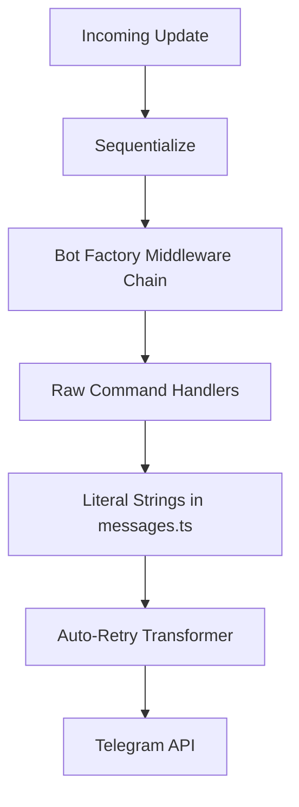
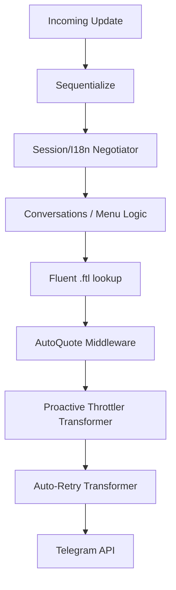

# Research Report: Advanced grammY Plugin Integration

**Project**: Nezuko Telegram Bot Platform  
**Target Runtime**: grammY v1.41+ | Bun | TypeScript 5.9  
**Status**: Comprehensive Research & Analysis Phase  
**Last Updated**: 2026-03-10

---

## 1. Executive Summary

This report provides a deep technical analysis of the proposed integration plan for five core grammY plugins: **Throttler**, **Autoquote**, **i18n (Fluent)**, **Menu**, and **Conversations**.

The primary objective is to transition the Nezuko Bot from a "Command-Response" architecture to a "Professional Application" architecture. This involves moving from hardcoded strings to localization files, from reactive error handling to proactive rate limiting, and from static messages to reactive UI components.

---

## 2. Technical Architecture Comparison

### Current State (Phase 119)



### Target State (Phase 125+)



---

## 3. Deep-Dive: Plugin Analysis & Researched Implementation

### 3.1 grammY Throttler (`@grammyjs/transformer-throttler`)

The bot currently relies on `auto-retry`, which consumes "Flood Wait" errors _after_ they happen. The Throttler prevents the ban from ever occurring.

- **Researched Mechanics**: Uses the `Bottleneck` library to queue outgoing API calls.
- **Default Limits**:
  - `global`: 30 jobs/sec.
  - `group`: 1 job/sec, max 20 per minute.
  - `out`: 1 job/sec (Private chats).
- **Critical implementation Detail**: It must be the **first** transformer in `bot.api.config.use()`. If `auto-retry` is first, it might retry too fast and trigger secondary bans.
- **Recommendation**: Wire into `src/core/bot-factory.ts`.

### 3.2 Autoquote (`@roziscoding/grammy-autoquote`)

Especially critical for group management bots where multiple users interact simultaneously.

- **Risk**: If a bot replies to a message, and the user deletes that message _instantly_, the bot call might fail.
- **Researched Mitigation**: Use the `allowSendingWithoutReply: true` option during initialization.
- **Middleware Order**: Should be early in the chain, but after `hydrate()`.

### 3.3 Internationalization (`@grammyjs/i18n`) - Fluent Implementation

Moving away from `messages.ts` (TypeScript literals) to Project Fluent (`.ftl`).

- **Why Fluent?**: Traditional i18n (like gettext) fails at pluralization in many languages (e.g., Russian has 3 plural forms). Fluent handles this with built-in logic.
- **Technical Gotcha found**: Fluent adds Bidi (bi-directional) isolation characters for safety. This often converts `<br>` or `<b>` tags into literal text in Telegram because Telegram's parser sees the invisible characters.
- **Researched Fix**:
  ```typescript
  const i18n = new I18n({
    fluentBundleOptions: { useIsolating: false },
  });
  ```

### 3.4 Interactive Menus (`@grammyjs/menu`)

Replaces multiple messages for "Settings" with a single reactive message.

- **Researched Mechanics**: grammY Menu uses **Shallow Rendering**. When a button is clicked, it doesn't run the whole bot logic—it only reruns the code that builds the menu to find the handler.
- **Integration Point**: `/settings` command will no longer send a string. It will send a `Menu` instance.
- **Stability**: Menus must be defined at the **module level** (top level), never inside a handler. Creating a new menu inside a function causes memory leaks.

### 3.5 Conversations (`@grammyjs/conversations`)

The most complex but powerful plugin for step-by-step logic.

- **The "Replay" Logic**: To maintain "waiting" state without staying in memory for days, the plugin **replays** the function on every update.
- **CRITICAL RULE**: Every side effect (DB update, Math.random, console.log) **must** be wrapped in `conversation.external()`.
- **State Conflict**: If the bot is updated while a user is mid-conversation, the conversation might crash if the code structure changed.
- **Recommended Use Case**: Bot Onboarding Wizard and Channel Linking Wizard.

---

## 4. Risks, Mitigations & Migration Strategy

| Risk                      | Mitigation                                                                                                                     |
| :------------------------ | :----------------------------------------------------------------------------------------------------------------------------- |
| **MiddleWare Bloat**      | Use explicit `NezukoContext` type intersections to keep TypeScript performant.                                                 |
| **Rate Limit Confusion**  | Throttler (Proactive) + Auto-Retry (Reactive) together create a "Double Defense" layer.                                        |
| **i18n Migration Effort** | Perform a phased migration. Keep `src/utils/messages.ts` for system logs, move user-facing UI to Fluent.                       |
| **Conflict 409**          | Ensure strictly one bot instance runs when testing Throttler, or multiple instances will fight for the same rate-limit bucket. |

---

## 5. Implementation Roadmap (Phased Approach)

### Phase 1: Stability (The "Invisible" Upgrades)

- [ ] Install Throttler & Autoquote.
- [ ] Wire both into `bot-factory.ts`.
- [ ] Verify group interaction legibility.

### Phase 2: Structuring (The "Data" Upgrades)

- [ ] Install `@grammyjs/i18n`.
- [ ] Define `locales/en.ftl`.
- [ ] Refactor `NezukoContext` to support translation flavor.

### Phase 3: Interaction (The "User" Upgrades)

- [ ] Implement `src/menus/settings.menu.ts`.
- [ ] Implement `src/conversations/onboarding.convo.ts`.
- [ ] Wire into `adminComposer`.

---

**Report Authored By**: Antigravity AI  
**Research References**: grammY.dev, Project Fluent, grammY GitHub Repositories.
