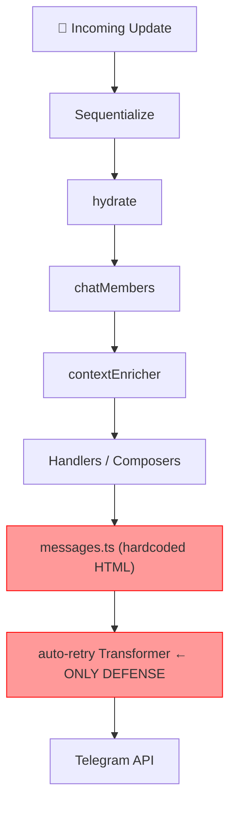
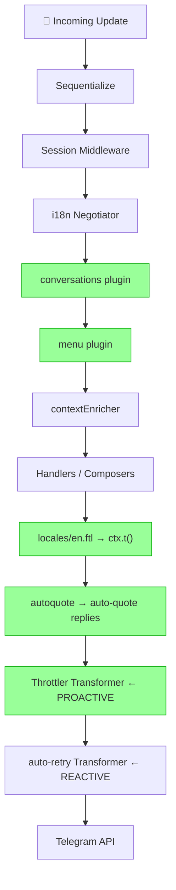

# 🔌 Plugin Integration Analysis — Nezuko Bot (Phase 120)

> Analyzed from: [RESEARCH_REPORT_PLUGIN_INTEGRATION.md](file:///c:/Users/akila/OneDrive/Desktop/OSS/WebsitesBots/Telegram/GroupManagerBot/Nezuko-Telegram-Bot/RESEARCH_REPORT_PLUGIN_INTEGRATION.md), [PLUGIN_INTEGRATION_PLAN.md](file:///c:/Users/akila/OneDrive/Desktop/OSS/WebsitesBots/Telegram/GroupManagerBot/Nezuko-Telegram-Bot/PLUGIN_INTEGRATION_PLAN.md), grammY skill references, Context7 docs, and full memory bank.
> Current phase: **Phase 120** | 163 tests passing | grammY v1.41.1 | Bun runtime

---

## TL;DR — Should You Use These Plugins?

| Plugin | Verdict | Priority |
|--------|---------|----------|
| `@grammyjs/transformer-throttler` | ✅ **YES — Do It Now** | 🔴 High |
| `@roziscoding/grammy-autoquote` | ✅ **YES — Do It Now** | 🔴 High |
| `@grammyjs/i18n` (Fluent) | ⚠️ **YES — Plan It Carefully** | 🟡 Medium |
| `@grammyjs/menu` | ✅ **YES — Recommended** | 🟡 Medium |
| `@grammyjs/conversations` | ⚠️ **YES — But Be Careful** | 🟢 Low |

---

## 1. Architecture: Current vs Target

### Current (Phase 119)



### Target (Phase 125+ — After All Plugins)



---

## 2. Per-Plugin Deep Analysis

---

### 2.1 🚦 Throttler (`@grammyjs/transformer-throttler`)

**What it does:** Proactively queues outgoing API calls using [Bottleneck](https://github.com/SGrondin/bottleneck) so Telegram's rate limits are **never hit** in the first place.

#### Current vs After

| Aspect | Current (No Throttler) | After (With Throttler) |
|--------|----------------------|----------------------|
| Rate limit defense | ❌ Reactive only — waits for Telegram to return 429 | ✅ Proactive — queues calls before they're sent |
| Flood wait bans | ⚠️ Possible under burst group activity | ✅ Prevented — Bottleneck absorbs bursts |
| Global outgoing rate | No control | ✅ Max 30 jobs/sec globally |
| Group outgoing rate | No control | ✅ Max 20/min, 1 concurrent per group |
| Private chat rate | No control | ✅ 1 job/sec sequential |
| Double defense | ❌ Only auto-retry exists | ✅ Throttler (proactive) + auto-retry (reactive) |
| Memory overhead | None | ~1–5 MB (Bottleneck queue) |

#### Pros vs Cons

| ✅ Pros | ❌ Cons |
|---------|---------|
| Prevents Telegram temp bans under load | Adds latency to bursts (queuing introduces delay) |
| Works seamlessly with `@grammyjs/runner` (already in use) | Undocumented Telegram limits NOT covered — need to keep auto-retry too |
| Zero logic changes needed in any composer | Must be registered **before** auto-retry in `bot.api.config.use()` |
| Default config matches Telegram docs exactly | No per-user scoping (only global/group/private) |
| No context flavor needed | Added npm dependency (`bottleneck`) |

> **⚠️ Critical Nedded Order** (from grammY ref docs):
> ```ts
> // MUST be first — throttler queues BEFORE auto-retry retries
> bot.api.config.use(throttler);
> bot.api.config.use(autoRetry({ maxRetryAttempts: 3 }));
> bot.api.config.use(htmlTransformer);
> bot.api.config.use(apiLogTransformer);
> ```

**Verdict:** 🟢 **Low-risk, high-value. Install in Phase 121.**

---

### 2.2 💬 Autoquote (`@roziscoding/grammy-autoquote`)

**What it does:** Automatically sets `reply_parameters` on every `ctx.reply()` call so replies always quote the original user message visually in Telegram.

#### Current vs After

| Aspect | Current (No Autoquote) | After (With Autoquote) |
|--------|----------------------|----------------------|
| Reply clarity in groups | ❌ Bot replies float freely — unclear who they're for | ✅ Every reply is visually anchored to the triggering message |
| Group usability | ⚠️ Confusing in busy groups with multiple users | ✅ Crystal-clear context for each response |
| Code changes required | Many handlers would need manual `reply_parameters` | ✅ Zero handler changes — fully automatic |
| Message deletion risk | N/A | ⚠️ If user deletes message before reply, bot call fails UNLESS `allowSendingWithoutReply: true` is set |
| Middleware position | N/A | Must be **after** `hydrate()` |

#### Pros vs Cons

| ✅ Pros | ❌ Cons |
|---------|---------|
| Instantly improves UX in busy groups | Third-party (not official grammY org) — check repo maintenance status |
| Zero changes to any handler or composer | Need `allowSendingWithoutReply: true` to avoid failure on deleted messages |
| Already identified as key gap in audit | Adds a middleware step (trivial overhead) |
| Particularly important for verification prompts | Reply quoting may look noisy in small/quiet groups |

> **⚠️ Required config:**
> ```ts
> import { addReplyParam } from "@roziscoding/grammy-autoquote";
> // With fallback to no-reply if message was deleted:
> bot.use(addReplyParam); // registers after hydrate()
> ```
> Research report recommends `allowSendingWithoutReply: true` — confirm this is an option on the package.

**Verdict:** 🟢 **Low-risk, high UX value. Install in Phase 121 alongside Throttler.**

---

### 2.3 🌐 i18n / Fluent (`@grammyjs/i18n`)

**What it does:** Replaces hardcoded strings in `src/utils/messages.ts` (~150+ lines) with `.ftl` locale files, enabling proper pluralization, dynamic placeholders, and future multi-language support.

#### Current vs After

| Aspect | Current (`messages.ts`) | After (`@grammyjs/i18n` + Fluent) |
|--------|------------------------|----------------------------------|
| Message storage | TypeScript constants file | `.ftl` locale files in `src/locales/` |
| Pluralization | Manual ternary in TS (`"1 channel" / "N channels"`) | ✅ Built-in Fluent grammar rules |
| i18n support | ❌ English-only, hardcoded | ✅ Any language, hot-loadable |
| Message access | `import { MSG } from "./messages"` | `ctx.t("message-key")` |
| TypeScript | Clean | Requires `I18nFlavor` added to `NezukoContext` |
| HTML parse mode | ✅ Works fine with `htmlTransformer` | ⚠️ **Fluent adds BiDi isolation chars by default** — breaks `<b>` HTML tags in Telegram |
| System logs | Stay in `messages.ts` | Only user-facing strings migrate |

#### The Critical Gotcha — Fluent BiDi Isolation

> **Source: [RESEARCH_REPORT_PLUGIN_INTEGRATION.md](file:///c:/Users/akila/OneDrive/Desktop/OSS/WebsitesBots/Telegram/GroupManagerBot/Nezuko-Telegram-Bot/RESEARCH_REPORT_PLUGIN_INTEGRATION.md) §3.3 + grammY i18n plugin docs**

Fluent wraps translated values in **Unicode BiDi isolation characters** by default for RTL safety. Telegram's HTML parser treats these invisible characters as separators, breaking `<b>tag</b>` into literal text.

**Required fix:**
```ts
const i18n = new I18n<NezukoContext>({
  defaultLocale: "en",
  directory: "locales",
  fluentBundleOptions: { useIsolating: false }, // ← CRITICAL
});
```

#### Pros vs Cons

| ✅ Pros | ❌ Cons |
|---------|---------|
| Proper pluralization (e.g., "1 channel" vs "2 channels") | **150+ string migration** — manual, one-to-one verification needed |
| Future: Russian/Arabic support possible | `I18nFlavor` adds to `NezukoContext` type intersection |
| `ctx.t("key")` is cleaner than `import CONST` | BiDi gotcha MUST be disabled (easy once known) |
| Locale negotiator can auto-detect user's Telegram language | Requires session middleware installed first for per-user locale |
| System log strings can stay in `messages.ts` — phased migration | New `.ftl` syntax learning curve |
| Recommended by grammY for all production bots | Code coverage: all command handlers need test updates |

#### Context Type Impact

```ts
// Current NezukoContext
type NezukoContext = Context & HydrateFlavor<Context>; // simplified

// After i18n
import { I18nFlavor } from "@grammyjs/i18n";
type NezukoContext = HydrateFlavor<Context & I18nFlavor>;
```

**Verdict:** 🟡 **Recommended but needs careful migration planning. Phase 122 with phased string moving.**

---

### 2.4 📋 Interactive Menus (`@grammyjs/menu`)

**What it does:** Replaces static text responses for admin commands like `/settings` with reactive, clickable, in-place menus that update without sending new messages.

#### Current vs After

| Aspect | Current (`/settings`) | After (`@grammyjs/menu`) |
|--------|----------------------|--------------------------|
| Settings display | Sends new text message with static buttons | ✅ In-place reactive menu that edits itself |
| Admin interaction | One message per action | ✅ Single dashboard message with live toggles |
| Group noise | Each setting change = new bot message | ✅ Single message, updated silently |
| Navigation | Not possible | ✅ Multi-page sub-menus (main → protection → channels) |
| Bot API calls | sendMessage per action | ✅ editMessage (1 call, reuses existing message) |
| Memory usage | None | Stateless! Menu plugin stores no data per menu |

> **Key grammY Menu fact (from plugin reference):** Menu uses **O(1) button lookup** — no matter how deep the menu hierarchy, button presses are resolved in constant time.

#### Stability Rules (from reference docs)

| Rule | Details |
|------|---------|
| ❌ NEVER create menus inside handlers | Memory leak — new `Menu("id")` inside a callback = crash over time |
| ✅ ALWAYS define menus at module/top level | Define once, reuse forever |
| ✅ Register sub-menus BEFORE `bot.use(mainMenu)` | Hierarchy must be complete before install |
| ✅ Only install the ROOT menu on bot | Child menus are resolved through registry |
| ✅ Use dynamic ranges for data-driven buttons | Not new Menu instances per click |

#### Pros vs Cons

| ✅ Pros | ❌ Cons |
|---------|---------|
| Eliminates group message noise for admin tasks | Admin interaction now has a learning curve (clickable ui ≠ commands) |
| Professional UX — feels like a real app | `callback_query` must be in `ALLOWED_UPDATES` (it already is) |
| Dynamic buttons (toggle states) | Menu installed BEFORE `verifyComposer` — ordering must be correct |
| Zero additional DB/storage needed (stateless) | Outdated menu detection may confuse users after bot restarts |
| `ctx.menu.update()` efficiently re-renders in one API call | `NezukoContext` may need `MenuFlavor` depending on version |

**Verdict:** 🟢 **High value for the `/settings` command. Phase 123, after i18n is stable.**

---

### 2.5 🔄 Conversations (`@grammyjs/conversations`)

**What it does:** Enables multi-step dialogs where the bot pauses and resumes between updates — ideal for wizard-style onboarding flows.

#### Current vs After

| Aspect | Current | After (`@grammyjs/conversations`) |
|--------|---------|-----------------------------------|
| Bot onboarding | Admin reads docs / uses static `/help` | ✅ Step-by-step guided wizard |
| Channel setup | All-in-one `/channels` command + manual effort | ✅ Guided "Add a channel → Confirm → Done" flow |
| Error recovery | Re-run full command | ✅ Stays in conversation, prompts again |
| State management | None (stateless per update) | Uses session/storage for conversation state |
| Complexity | Simple command handlers | High — replay engine requires discipline |

#### The Replay Engine — Most Important Concept

> **Source:** grammY conversations reference, SKILL.md, and RESEARCH_REPORT §3.5

The conversation plugin replays your function from the start on **every new update**. This means any side-effect code runs multiple times unless wrapped:

| Code Type | How to Write It |
|-----------|----------------|
| DB reads (`db.getUser`) | `conversation.external(() => db.getUser(id))` |
| Random numbers | `await conversation.random()` |
| Timestamps | `await conversation.now()` |
| `ctx.reply(...)` | ✅ Safe — grammY handles replay deduplication |
| `console.log(...)` | `await conversation.log("msg")` |

#### Pros vs Cons

| ✅ Pros | ❌ Cons |
|---------|---------|
| Elegant multi-step UX — feels like a real conversation | **High complexity** — replay engine is subtle and unique concept |
| Bot deployment wizard would massively improve admin DX | **Side-effect rule is a hard constraint** — every DB write MUST use `conversation.external()` |
| Conversations are just async JavaScript functions | `sessions` middleware is required BEFORE conversations middleware |
| Filterable `conversation.waitFor()` for type safety | State persists in memory by default — needs storage adapter for bot restart survival |
| Supports sub-conversations and composition | Code changes to bot break mid-conversation state for active users |
| Active conversations can be exited via `ctx.conversation.exit("name")` | Conversations consume more resources per active user |

#### Required Middleware Order for Conversations

```ts
bot.use(session(...));                  // 1. Session FIRST
bot.use(conversations());              // 2. Conversation manager
bot.use(createConversation(setupWizard)); // 3. Register each conversation
bot.use(menu);                         // 4. Menu BEFORE composers
bot.use(contextEnricher(deps));        // 5. Context enricher
// ... composers
```

**Verdict:** 🟡 **Powerful but complex. Phase 124 — only for /setup wizard, not verification path.**

---

## 3. Implementation Risk Assessment

| Plugin | Risk Level | Key Risk | Mitigation |
|--------|-----------|----------|------------|
| **Throttler** | 🟢 Low | Must be before auto-retry | Fix transformer order in `bot-factory.ts` |
| **Autoquote** | 🟢 Low | Message deletion failure | Use `allowSendingWithoutReply: true` |
| **i18n/Fluent** | 🟡 Medium | BiDi isolation breaks HTML tags | Set `useIsolating: false` in `I18nFlavor` config |
| **i18n/Fluent** | 🟡 Medium | 150+ string migration effort | Phase migration: system logs stay in `messages.ts` |
| **Menu** | 🟡 Medium | `new Menu()` inside handler = memory leak | Strict linting / code review rule |
| **Conversations** | 🔴 High | Replay engine — DB side effects run multiple times | All DB/external calls MUST use `conversation.external()` |
| **Conversations** | 🔴 High | State lost on bot redeploy mid-conversation | Require persistent storage adapter (Redis adapter) |

---

## 4. Current vs After — Feature/Capability Comparison

| Capability | Current (Phase 119) | After Phase 125 |
|------------|---------------------|-----------------|
| Rate limit protection | ❌ Reactive only (429 → retry) | ✅ Proactive queue + reactive retry |
| Temp ban risk | ⚠️ Possible under Group burst | ✅ Eliminated |
| Group reply clarity | ❌ Floating replies | ✅ Quoted replies |
| Message maintenance | ❌ Edit 150+ TS strings across files | ✅ Single `.ftl` file per locale |
| Pluralization logic | ❌ Manual ternary in TS | ✅ Fluent grammar (built-in) |
| Multi-language support | ❌ None | ✅ Ready |
| Admin settings UX | ❌ New message + static buttons per action | ✅ One reactive dashboard message |
| Group noise from admin | ⚠️ Multiple bot messages per setting | ✅ In-place updates |
| Onboarding new admins | ❌ External documentation only | ✅ Guided `setup` wizard |
| Test coverage | 163 tests passing | Expect new tests for each plugin |
| Context type size | Lean | Grows by 2–3 flavors |

---

## 5. Corrected Middleware Order (After All Plugins)

This is the exact order for `bot-factory.ts` after integration:

```ts
// ── API Transformers (outgoing) ───────────────────────────────
bot.api.config.use(throttler);          // 1. Throttler FIRST
bot.api.config.use(autoRetry({ maxRetryAttempts: 3 }));
bot.api.config.use(htmlTransformer);    // existing custom transformer
bot.api.config.use(apiLogTransformer);  // Phase 105 telemetry

// ── Middleware (upstream → downstream) ────────────────────────
bot.use(sequentializeMiddleware);       // MUST be position 1
bot.use(session({ ... }));              // NEW: before conversations & i18n
bot.use(i18n);                          // NEW: after session
bot.use(hydrate());
bot.use(chatMembers(cache.chatMembersAdapter));
bot.use(contextEnricher(deps));
bot.use(addReplyParam);                 // NEW: autoquote, after enricher
bot.use(adminMenu);                     // NEW: menu, before composers

// ── Core commands ────────────────────────────────────────────
wireCoreCommands(bot, deps);

// ── Conversations (before composer that enters them) ──────────
bot.use(conversations());               // NEW
bot.use(createConversation(setupWizard)); // NEW

// ── Composers with real protected mounting ────────────────────
bot.use(adminBoundary);
bot.use(channelsBoundary);
bot.use(migrationBoundary);
bot.use(eventsBoundary);
bot.use(verifyBoundary);
bot.use(fallbackComposer);              // ALWAYS last

bot.catch(async (err) => { ... });
```

---

## 6. Phased Implementation Roadmap

| Phase | Work | Plugins | Est. Effort | Risk |
|-------|------|---------|-------------|------|
| **121** | Install Throttler + Autoquote. Wire into `bot-factory.ts`. Update tests. | Throttler, Autoquote | 🟢 Small (~1–2 hrs) | 🟢 Low |
| **122** | Create `locales/en.ftl`. Migrate UI strings. Add `I18nFlavor`. Verify all commands. | i18n/Fluent | 🟡 Medium (~1 day) | 🟡 Medium |
| **123** | Create `src/menus/` dir. Build `adminMenu`. Replace `/settings` static output. | Menu | 🟡 Medium (~4 hrs) | 🟡 Medium |
| **124** | Add conversations. Implement `setupWizard` for new groups. Wire into setup composer. | Conversations | 🔴 Large (~1–2 days) | 🔴 High |

---

## 7. Final Recommendation Summary

> **Should you use these plugins?**

**Yes — all five are worth integrating**, but in order of priority:

1. **Start with Throttler + Autoquote** (Phase 121) — these are "invisible" stability upgrades with near-zero risk and no logic changes. They should have been in from day one.

2. **Then i18n** (Phase 122) — significant effort but the right architectural move. The 150+ string migration is the main cost, but the `messages.ts` file is already a pain point and will only grow.

3. **Then Menu** (Phase 123) — the `/settings` command badly needs an interactive UX overhaul. Low-risk once i18n is in place.

4. **Finally Conversations** (Phase 124) — powerful but complex. Only add this once the team is comfortable with the replay engine. **Never use conversations on the verification hot-path** — keep that handler-based.

> ⚠️ **Do NOT add Conversations to the verification flow**. The delayed-prompt, lock, and Redis-based enforcement system is already well-tested (163 tests). Conversations' replay engine would complicate that path significantly with no benefit.

---

*Analysis by: Antigravity AI | Based on: grammY v1.41+ official reference docs (Context7), skill references, and Nezuko Phase 120 memory bank*
