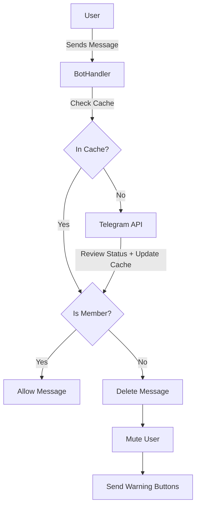

# System Patterns

## Architecture
The system follows a standard Telegram Bot architecture:
1.  **Telegram Bot API**: The interface for interacting with Telegram.
2.  **Bot Logic (Backend)**: Python (`python-telegram-bot` v20+) application.
3.  **Polling**: `Application.run_polling` with **Concurrent Updates** enabled for performance.

## Key Components
1.  **Message Handler**: Intercepts group messages (text/media) via `filters.ChatType.GROUPS`.
2.  **Membership Checker**:
    *   Checks in-memory **LRU Cache** (5-minute TTL) first.
    *   Calls `getChatMember` on cache miss.
3.  **Restriction Engine**:
    *   Mutes: `can_send_messages=False`.
    *   Unmutes: Grants specific granular permissions (`can_send_photos`, `can_send_videos`, etc.) to match Telegram API 7.x+ requirements.
4.  **Interaction Manager**: Handles "Join" (URL) and "Verify" (Callback) button clicks.

## Design Patterns
*   **Event-Driven**: Actions are triggered by Telegram events (New Message, Callback Query).
*   **Fail-Safe**: If membership check fails (e.g., API timeout), it logs error and denies access (Strict Mode) currently, but prints clean errors.
*   **Caching**: In-memory dictionary `membership_cache[user_id] = (status, timestamp)` to minimize API rate limits and latency.
*   **Async Concurrency**: Usage of `concurrent_updates(True)` in Application Builder to prevent head-of-line blocking during network calls.

## Data Flow

