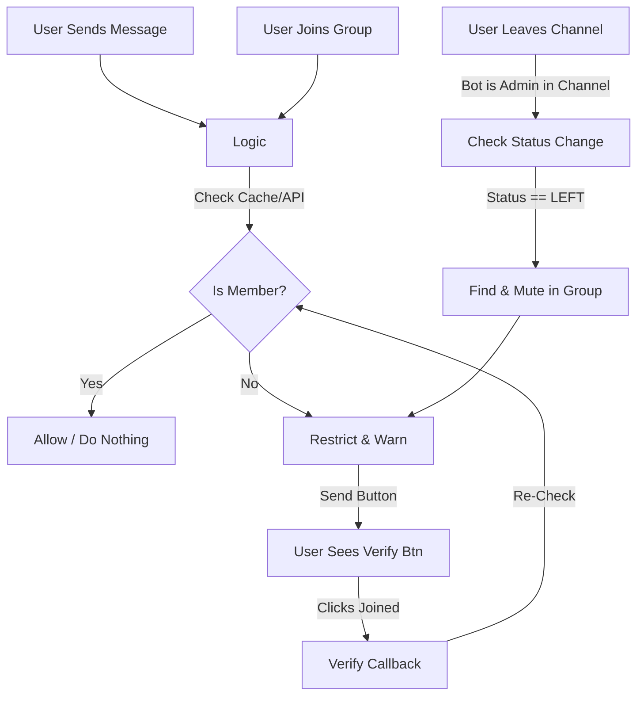

# System Patterns

## Architecture
The system follows a standard Telegram Bot architecture:
1.  **Telegram Bot API**: The interface for interacting with Telegram.
2.  **Bot Logic (Backend)**: Python (`python-telegram-bot` v20+) application.
3.  **Polling**: `Application.run_polling` with **Concurrent Updates** enabled for performance.

## Key Components
1.  **Message Handler**: Intercepts group messages (text/media) via `filters.ChatType.GROUPS`.
2.  **Join Handler**: Intercepts `NEW_CHAT_MEMBERS` to immediately verify users entering the group.
3.  **Channel Watcher**: listens to `ChatMemberUpdated` events from the **Channel**.
    *   Detects `LEFT` status.
    *   Triggers immediate restriction in the Group (referenced by `GROUP_ID`).
4.  **Membership Checker**:
    *   Checks in-memory **LRU Cache** (5-minute TTL) first.
    *   Calls `getChatMember` on cache miss.
5.  **Restriction Engine**:
    *   Mutes: `can_send_messages=False`.
    *   Unmutes: Grants specific granular permissions (`can_send_photos`, `can_send_videos`, etc.).
6.  **Interaction Manager**: Handles "Join" (URL) and "Verify" (Callback) button clicks.

## Design Patterns
*   **Event-Driven**: Actions are triggered by Telegram events (New Message, Callback Query, **Chat Member Update**).
*   **Proactive Policing**: Instead of waiting for a violation (message), we catch the state change (Join/Leave).
*   **Fail-Safe**: If membership check fails (e.g., API timeout), it logs error and denies access (Strict Mode).
*   **Caching**: In-memory dictionary `membership_cache[user_id] = (status, timestamp)` to minimize API rate limits.

### Strict Verification Logic (v1.1)
1.  **Instant Join**:
    *   **Trigger**: `filters.StatusUpdate.NEW_CHAT_MEMBERS`.
    *   **Action**: Iterate users -> Check Subscription -> Mute if false -> Send Welcome/Warn.
2.  **Strict Leave**:
    *   **Trigger**: `ChatMemberHandler` (Admin in Channel).
    *   **Logic**: Detects `update.chat_member.new_chat_member.status == LEFT`.
    *   **Enforcement**: Uses `GROUP_ID` to find the user in the target group -> Mutes them -> Sends Warning Message.

*   **Async Concurrency**: Usage of `concurrent_updates(True)` in Application Builder.

## Data Flow

