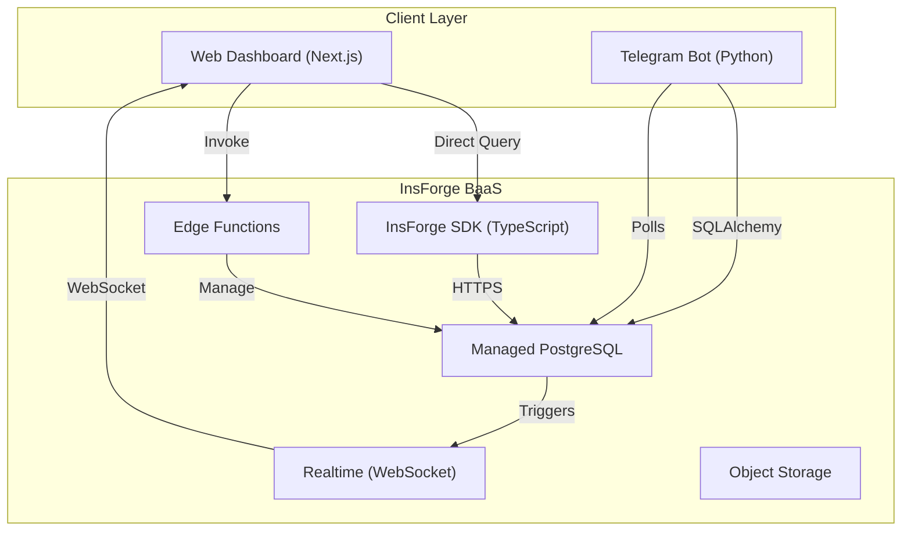
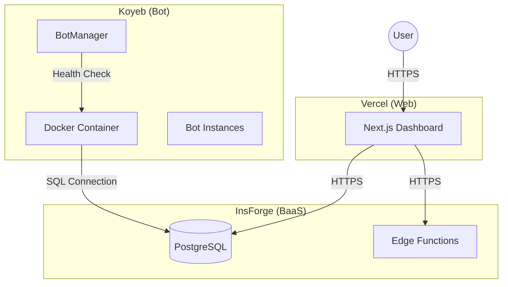

# System Patterns: Architecture & Implementation

## Architecture Overview

### Current (InsForge BaaS)

The Nezuko Platform now operates on a **2-tier architecture**, fully leveraging InsForge BaaS. The legacy API layer (`apps/api`) has been permanently removed.



---

## Hosting Architecture (Cloud)



---

## Bot Patterns (Python)

### Async-First Architecture

All I/O operations must use `async/await` to ensure the bot remains responsive.

```python
# ✅ Correct: Async database query
async def get_groups(session: AsyncSession) -> list[Group]:
    result = await session.execute(select(Group))
    return result.scalars().all()
```

### Task Reference Pattern (RUF006)

We must maintain strong references to background tasks to prevent garbage collection during execution.

```python
# ✅ Correct: Store task reference
_tasks: set[asyncio.Task] = set()
task = asyncio.create_task(some_coroutine())
_tasks.add(task)
task.add_done_callback(_tasks.discard)
```

### SQLAlchemy 2.0 Queries

We use the modern `select()` syntax, not the legacy ORM methods.

```python
# ✅ Correct: SQLAlchemy 2.0 style
stmt = select(Model).where(Model.id == id)
result = await session.execute(stmt)
```

### Bot-to-Dashboard Communication

The bot communicates with the dashboard exclusively through the **Database**.

1.  **Status Updates**: Bot performs an `UPSERT` on the `bot_status` table every 30 seconds.
2.  **Command Execution**: Bot polls the `admin_commands` table (status='pending') every 1 second.
3.  **Logging**: Bot writes to `verification_log` and `admin_logs`.

---

## Frontend Patterns (Next.js 16)

### InsForge SDK Service Pattern

The frontend communicates directly with InsForge. There is no intermediate API server.

```typescript
// ✅ Correct: Service uses SDK directly
import { insforge } from "@/lib/insforge";

export async function getDashboardStats() {
  const { data, error } = await insforge.database.rpc("get_dashboard_stats");
  if (error) throw error;
  return data;
}
```

### Realtime Hooks

We use the InsForge Realtime client (WebSocket) to listen for database changes.

```typescript
// ✅ Correct: Realtime subscription
export function useDashboardRealtime() {
  const queryClient = useQueryClient();

  useEffect(() => {
    const subscription = insforge.realtime
      .channel("dashboard")
      .on("verification", () => {
        // Invalidate queries to fetch fresh data
        queryClient.invalidateQueries({ queryKey: ["dashboard"] });
      })
      .subscribe();

    return () => { subscription.unsubscribe(); };
  }, []);
}
```

### Edge Function Invocation

Sensitive operations (like bot token management) are handled by Edge Functions.

```typescript
// ✅ Correct: Invoke Edge Function
const { data, error } = await insforge.functions.invoke('manage-bot', {
  body: { action: 'verify', token: '...' }
});
```

---

## Database Schema (InsForge Managed PostgreSQL)

The database is the single source of truth.

### Key Tables
| Table | Purpose |
| --- | --- |
| `owners` | Bot owners (Telegram user IDs) |
| `bot_instances` | Registered bot tokens (Fernet encrypted) |
| `protected_groups` | Groups with verification enforcement |
| `enforced_channels` | Required channel subscriptions |
| `admin_commands` | Dashboard→Bot command queue |
| `verification_log` | Analytics data source |

### Realtime Triggers
Database triggers automatically push events to WebSocket channels.
- `notify_verification_event` → `dashboard` channel
- `notify_bot_status_event` → `bot_status` channel
- `notify_command_event` → `commands` channel

---

_Last Updated: 2026-02-13_
