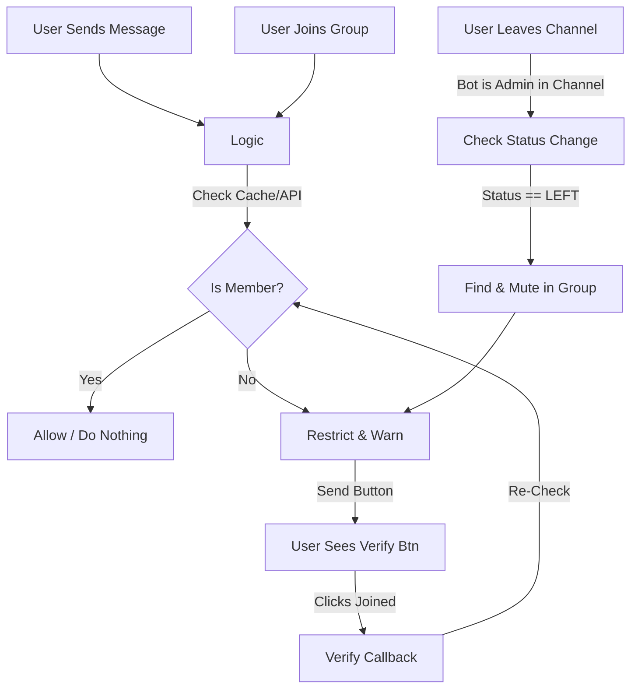

# System Patterns

## Current Architecture (v1.1)
The system follows a standard Telegram Bot architecture:
1.  **Telegram Bot API**: The interface for interacting with Telegram.
2.  **Bot Logic (Backend)**: Python (`python-telegram-bot` v20+) application.
3.  **Polling**: `Application.run_polling` with **Concurrent Updates** enabled for performance.

## Planned Architecture (v2.0)
**Status**: All 4 Development Phases Complete ✅

### Implementation Status
- ✅ **Phase 1**: Modular architecture, database layer, admin commands
- ✅ **Phase 2**: Multi-tenant verification, Redis caching, event handlers
- ✅ **Phase 3**: Performance optimization, load testing, horizontal scaling
- ✅ **Phase 4**: Monitoring, observability, health checks, Sentry, structured logging

### Core Stack
*   **Runtime**: Python 3.13+ (AsyncIO)
*   **Framework**: `python-telegram-bot` v20+ with `concurrent_updates=True`
*   **Database**: PostgreSQL (production) / SQLite (development) via SQLAlchemy Async + Alembic
*   **Caching**: Redis (async) for distributed state, verification cache
*   **Rate Limiting**: AIORateLimiter (30msg/sec with priority queuing)
*   **Update Mode**: Auto-detect (polling for dev, webhooks for production)
*   **Monitoring**: Prometheus + Sentry

### Modular Monolith Structure
```
bot/
├── core/          # Database, cache, rate limiter, handler loader
├── database/      # Models, CRUD, migrations
├── handlers/      # Admin, events, verification
├── services/      # Protection, verification, Telegram API wrappers
└── utils/         # Metrics, logging
```

## Key Components (v1.1)
1.  **Message Handler**: Intercepts group messages (text/media) via `filters.ChatType.GROUPS`.
2.  **Join Handler**: Intercepts `NEW_CHAT_MEMBERS` to immediately verify users entering the group.
3.  **Channel Watcher**: listens to `ChatMemberUpdated` events from the **Channel**.
    *   Detects `LEFT` status.
    *   Triggers immediate restriction in the Group (referenced by `GROUP_ID`).
4.  **Membership Checker**:
    *   Checks in-memory **LRU Cache** (5-minute TTL) first.
    *   Calls `getChatMember` on cache miss.
5.  **Restriction Engine**:
    *   Mutes: `can_send_messages=False`.
    *   Unmutes: Grants specific granular permissions (`can_send_photos`, `can_send_videos`, etc.).
6.  **Interaction Manager**: Handles "Join" (URL) and "Verify" (Callback) button clicks.

## Enhanced Components (v2.0)
1.  **Database Layer**: PostgreSQL with async session management, connection pooling
2.  **Distributed Cache**: Redis with TTL jitter (10min positive, 1min negative)
3.  **Priority Rate Limiter**: P0 (user interactions) > P1 (enforcement) > P2 (bulk operations)
4.  **Admin Command Handlers**: `/protect`, `/status`, `/unprotect`, `/settings`
5.  **Observability Stack**: Prometheus metrics, structured logs, health checks, Sentry

## Design Patterns (v1.1)
*   **Event-Driven**: Actions are triggered by Telegram events (New Message, Callback Query, **Chat Member Update**).
*   **Proactive Policing**: Instead of waiting for a violation (message), we catch the state change (Join/Leave).
*   **Fail-Safe**: If membership check fails (e.g., API timeout), it logs error and denies access (Strict Mode).
*   **Caching**: In-memory dictionary `membership_cache[user_id] = (status, timestamp)` to minimize API rate limits.

## Enhanced Patterns (v2.0)
*   **Multi-Tenant**: Database-driven configuration supporting 100+ groups independently
*   **Graceful Degradation**: Redis failure → falls back to API calls (degraded, not broken)
*   **Zero Trust**: New members verified on join, existing members watched for channel exit
*   **Horizontal Scaling**: Shared Redis/DB allows multiple bot instances
*   **Observable by Default**: All operations emit metrics, logs include full context
*   **Priority Queuing**: User-facing actions never delayed by background operations

### Strict Verification Logic (v1.1)
1.  **Instant Join**:
    *   **Trigger**: `filters.StatusUpdate.NEW_CHAT_MEMBERS`.
    *   **Action**: Iterate users -> Check Subscription -> Mute if false -> Send Welcome/Warn.
2.  **Strict Leave**:
    *   **Trigger**: `ChatMemberHandler` (Admin in Channel).
    *   **Logic**: Detects `update.chat_member.new_chat_member.status == LEFT`.
    *   **Enforcement**: Uses `GROUP_ID` to find the user in the target group -> Mutes them -> Sends Warning Message.

*   **Async Concurrency**: Usage of `concurrent_updates(True)` in Application Builder.

### Multi-Tenant Verification (v2.0 - Planned)
1.  **Database Query**: Lookup `protected_groups` and `group_channel_links` for group
2.  **Cache-Aware Check**: Query Redis before Telegram API (70%+ hit rate)
3.  **Multi-Channel Support**: Verify membership in ALL linked channels (AND logic)
4.  **Batched Operations**: Warm cache for large groups (100k+ members)

## Data Flow (v1.1)


## Performance Targets (v2.0)
| Metric | v1.1 (Current) | v2.0 (Target) |
|--------|----------------|---------------|
| Verification Latency | ~500ms | <100ms (p95) |
| Cache Hit Rate | N/A (in-memory) | >70% (Redis) |
| Database Query | N/A | <50ms (p95) |
| Throughput | ~50/min | 1000/min |
| Multi-Tenancy | 1 group | 100+ groups |

