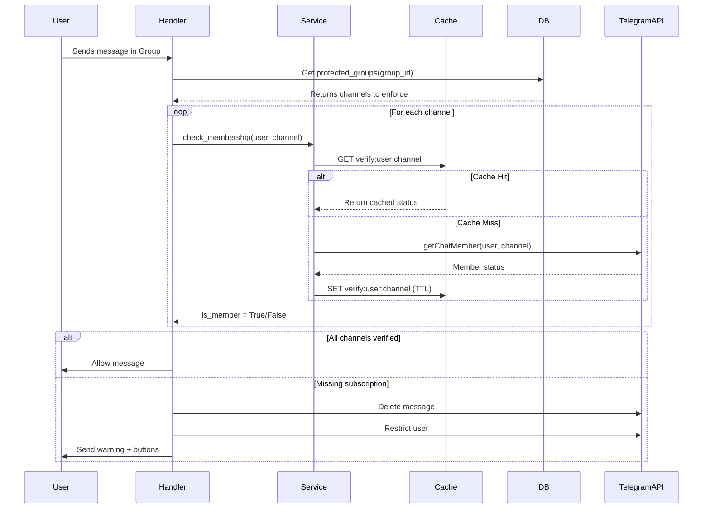
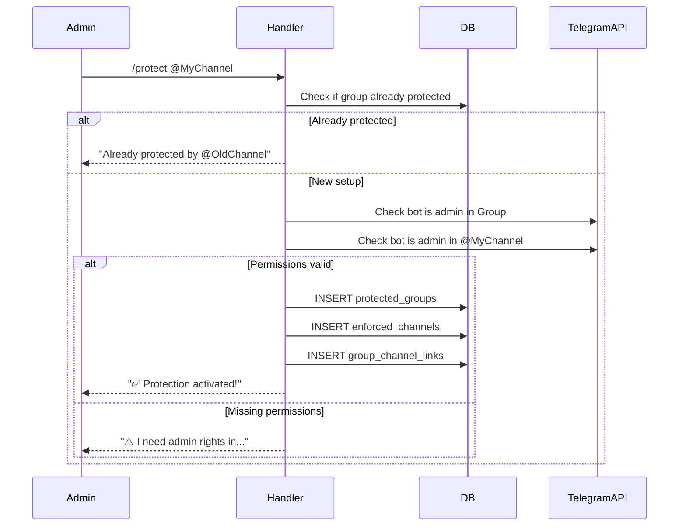

# Design: Production SaaS Architecture

## Context

**Current State (v1.1)**:
- Single Python file (`main.py`, 305 lines)
- Configuration via `.env` (one group-channel pair)
- In-memory caching (`dict` with 5-min TTL)
- Polling mode only
- No persistence layer
- No observability

**Target State (v2.0)**:
- Modular architecture supporting 100+ groups
- Database-driven configuration (PostgreSQL)
- Distributed caching (Redis)
- Webhooks for production, polling for dev
- Full observability stack
- <100ms verification latency at scale

**Stakeholders**:
- Bot administrators (group owners who configure the bot)
- End users (group members being verified)
- Platform operators (deploying and monitoring the bot)

**Constraints**:
- Must maintain existing verification behavior (backwards compatibility for UX)
- Telegram rate limits: 30 messages/second globally
- No deployment infrastructure changes in this phase (deferred)

## Goals / Non-Goals

### Goals
1. **Multi-Tenancy**: Support unlimited groups/channels with database-driven config
2. **Performance**: <100ms verification latency (p95), 1000+ verifications/min throughput
3. **Reliability**: 99.9% uptime through proper error handling, caching, rate limiting
4. **Observability**: Full visibility via metrics, logs, health checks
5. **Developer Experience**: Easy local development (SQLite + polling), seamless production (PostgreSQL + webhooks)

### Non-Goals
- Deployment automation (CI/CD, infrastructure-as-code) - **deferred**
- User-facing dashboard or web UI
- Billing/monetization features
- Advanced analytics or reporting
- Multi-language localization

## Architectural Decisions

### Decision 1: Modular Monolith (Not Microservices)

**Choice**: Single Python application with modular folder structure

**Rationale**:
- Simpler deployment and operations (one process)
- No network overhead between modules
- Easier local development and debugging
- Sufficient for target scale (100s of groups, not 1000s)
- Can split into services later if needed (but unlikely)

**Alternatives Considered**:
- ❌ Microservices (verification service + admin service): Premature complexity
- ❌ Keep single-file: Cannot scale or maintain at production level

**Trade-offs**:
- ✅ Pros: Simplicity, performance, easier debugging
- ❌ Cons: Cannot scale individual components independently (acceptable for current scope)

---

### Decision 2: PostgreSQL for Persistence

**Choice**: PostgreSQL 16+ with async SQLAlchemy + Alembic

**Rationale**:
- Production-grade ACID compliance
- Excellent performance with proper indexing
- Native JSONB support for flexible `params` column
- Wide ecosystem support (hosting, tooling)
- Async support via `asyncpg` driver

**Alternatives Considered**:
- ❌ SQLite: Great for dev, insufficient for multi-instance production deployment
- ❌ MongoDB: Overkill, no strong need for document model
- ❌ MySQL: Viable, but PostgreSQL preferred for JSONB and community support

**Implementation Details**:
- SQLite fallback for local development (`DATABASE_URL=sqlite:///./gmbot.db`)
- Connection pooling: 20 connections max (conservative for async workload)
- Alembic for schema migrations (versioned, rollback-safe)

---

### Decision 3: Redis for Distributed Caching

**Choice**: Redis 7+ with async client, optional in Phase 1

**Rationale**:
- Industry-standard distributed cache
- Sub-millisecond latency
- TTL support built-in
- Pub/Sub for future real-time features (if needed)

**Caching Strategy**:
```python
# Positive cache (user IS member): 10 minutes
cache_key = f"verify:{user_id}:{channel_id}"
ttl_positive = 600 + random.randint(-90, 90)  # Jitter ±15%

# Negative cache (user NOT member): 1 minute
ttl_negative = 60 + random.randint(-9, 9)  # Jitter ±15%
```

**Jitter Rationale**: Prevents thundering herd when many cached entries expire simultaneously

**Graceful Degradation**: If Redis unavailable, fall back to API calls (with warning logs)

**Alternatives Considered**:
- ❌ Memcached: No TTL per key, less feature-rich
- ❌ In-memory (current): Doesn't work with multiple bot instances

---

### Decision 4: AIORateLimiter for Telegram API

**Choice**: `telegram-ext-rate-limiter` with priority queuing

**Configuration**:
```python
AIORateLimiter(
    max_retries=3,
    overall_max_rate=25,      # 5msg/sec buffer below Telegram's 30/sec limit
    overall_time_period=1.0,
    group_max_rate=20,        # Per-chat rate limit
    group_time_period=60.0,
)
```

**Priority Queue Design**:
1. **P0 (Immediate)**: User interactions (verify button, admin commands) - <100ms
2. **P1 (High, <500ms)**: Join/leave events
3. **P2 (Low, queued)**: Broadcast messages - throttled to 5msg/sec

**Rationale**:
- Prevents `429 Too Many Requests` errors from Telegram
- Ensures interactive actions remain responsive
- Protects against API ban risk

**Alternatives Considered**:
- ❌ No rate limiting: Risk of API bans
- ❌ Simple sleep(): Doesn't prioritize user-facing actions

---

### Decision 5: Auto-Detecting Polling vs Webhooks

**Choice**: Runtime mode selection based on environment variables

**Logic**:
```python
if os.getenv("ENVIRONMENT") == "production" and os.getenv("WEBHOOK_URL"):
    # Production: Use webhooks for instant updates
    run_webhook(url=WEBHOOK_URL, port=8443)
else:
    # Development: Use polling for easy local testing
    run_polling()
```

**Rationale**:
- **Polling**: Easy local development, no public URL needed
- **Webhooks**: Required for production scale (100k+ members), instant updates
- Auto-detection eliminates code changes between environments

**Webhook Requirements**:
- Public HTTPS endpoint (SSL certificate required)
- `WEBHOOK_URL` environment variable (e.g., `https://bot.example.com`)
- `WEBHOOK_SECRET` for request validation

---

### Decision 6: Database Schema Design

**Schema Overview**:

```sql
owners (user_id PK, username, created_at, updated_at)
  ↓ 1:N
protected_groups (group_id PK, owner_id FK, title, enabled, params JSONB)
  ↓ M:N
group_channel_links (id PK, group_id FK, channel_id FK)
  ↓
enforced_channels (channel_id PK, title, invite_link)
```

**Key Decisions**:

1. **Many-to-Many Relationship** (`group_channel_links`):
   - Allows one group to require multiple channels (future feature)
   - Allows one channel to protect multiple groups (common use case)

2. **JSONB `params` Column**:
   - Stores flexible configuration (warning message, button text, custom settings)
   - Avoids schema changes for minor customizations
   - Indexed for performance: `CREATE INDEX idx_params_gin ON protected_groups USING GIN (params);`

3. **`enabled` Flag**:
   - Soft-disable protection without deleting configuration
   - Faster than DELETE + re-setup

**Indexes**:
```sql
-- lookup by owner
CREATE INDEX idx_groups_owner ON protected_groups(owner_id);

-- filter active groups
CREATE INDEX idx_groups_enabled ON protected_groups(enabled) WHERE enabled = TRUE;

-- lookup links by group
CREATE INDEX idx_links_group ON group_channel_links(group_id);

-- lookup links by channel
CREATE INDEX idx_links_channel ON group_channel_links(channel_id);
```

---

### Decision 7: Folder Structure (Modular Monolith)

```
bot/
├── __init__.py
├── main.py                 # Entry point, mode detection
├── config.py               # Environment variable validation
│
├── core/
│   ├── database.py         # Async SQLAlchemy session factory
│   ├── cache.py            # Redis client + decorators
│   ├── rate_limiter.py     # AIORateLimiter setup
│   └── loader.py           # Dynamic handler registration
│
├── database/
│   ├── models.py           # ORM models
│   ├── crud.py             # CRUD operations
│   └── migrations/         # Alembic versions
│
├── handlers/
│   ├── admin/
│   │   ├── setup.py        # /setup, /protect
│   │   ├── settings.py     # /status, /unprotect, /settings
│   │   └── help.py         # /help, /start
│   ├── events/
│   │   ├── join.py         # NEW_CHAT_MEMBERS
│   │   ├── leave.py        # ChatMemberHandler
│   │   └── message.py      # Message verification
│   └── verify.py           # Callback query (verify button)
│
├── services/
│   ├── protection.py       # Mute/unmute logic
│   ├── verification.py     # Membership check with cache
│   └── telegram.py         # Safe API wrappers
│
└── utils/
    ├── metrics.py          # Prometheus metrics
    └── logging.py          # Structured logging
```

**Rationale**:
- **`core/`**: Shared infrastructure (DB, cache, rate limiter)
- **`database/`**: All persistence logic in one place
- **`handlers/`**: Organized by responsibility (admin vs events)
- **`services/`**: Business logic decoupled from handlers
- **`utils/`**: Cross-cutting concerns (metrics, logging)

**Import Pattern**:
```python
# ✅ Good: Explicit imports
from bot.services.verification import check_membership
from bot.database.crud import get_group_channels

# ❌ Bad: Star imports
from bot.services import *
```

---

## Data Flow

### Verification Flow (Multi-Tenant)



### Setup Flow (Multi-Tenant)



---

## Risks / Trade-offs

### Risk 1: Database Performance at Scale

**Risk**: Database becomes bottleneck for 100+ groups with high message volume

**Mitigation**:
- Aggressive caching (10-min TTL reduces DB load by 90%)
- Database indexes on all foreign keys and query columns
- Connection pooling (20 connections)
- Read replicas (future, if needed)

**Monitoring**: Track `db_query_duration_seconds` metric (alert if p95 >50ms)

---

### Risk 2: Redis Unavailability

**Risk**: Redis failure breaks verification flow

**Mitigation**:
- **Graceful Degradation**: Fall back to direct API calls if Redis down
- **Warning Logs**: Alert operators to Redis issues
- **Health Check**: Include Redis ping in `/health` endpoint

**Code Example**:
```python
try:
    cached = await redis.get(cache_key)
    if cached:
        return cached
except RedisError:
    logger.warning("Redis unavailable, falling back to API")

# Continue with API call
```

---

### Risk 3: Telegram Rate Limits

**Risk**: High-traffic groups trigger `429 Too Many Requests`

**Mitigation**:
- AIORateLimiter caps at 25msg/sec (5msg/sec buffer)
- Priority queue ensures user interactions never queued
- Exponential backoff on retries (built into rate limiter)

**Monitoring**: Track `bot_rate_limit_delays_total` (alert if sustained >10/min)

---

### Risk 4: Migration Complexity

**Risk**: Migrating from v1.1 single-instance to v2.0 multi-tenant is confusing for users

**Mitigation**:
- **No Data Loss**: v1.1 has no persistent state to migrate
- **Clear Documentation**: Step-by-step `/protect` setup guide
- **Backwards Compatibility**: Old `.env` config ignored (not broken)
- **Incremental Rollout**: Can run v1.1 and v2.0 side-by-side during transition

---

## Migration Plan

### Phase 1: Code Refactoring
1. Create new `bot/` folder structure
2. Extract logic from `main.py` into modules
3. Keep original `main.py` as fallback (rename to `main_v1.py`)
4. Implement database models and migrations
5. Test with SQLite in development

### Phase 2: Database Cutover
1. Deploy PostgreSQL (or use managed service)
2. Run `alembic upgrade head` to create schema
3. Update environment variables (`DATABASE_URL`, `REDIS_URL`)
4. Restart bot with new codebase

### Phase 3: Group Migration
1. For each existing group: Run `/protect @YourChannel` in group
2. Bot stores config in database
3. Verify protection works end-to-end

### Phase 4: Cleanup
1. Remove `.env` variables (`CHANNEL_ID`, `GROUP_ID`, `CHANNEL_URL`)
2. Archive `main_v1.py`
3. Update documentation

**Rollback Plan**:
- Keep v1.1 codebase accessible (`main_v1.py`)
- Revert environment variables if issues found
- Database schema has Alembic downgrade scripts

---

## Performance Targets

| Metric | Target | Measurement |
|--------|--------|-------------|
| Verification Latency (p95) | <100ms | `bot_verification_latency_seconds` |
| Database Query (p95) | <50ms | `db_query_duration_seconds` |
| Cache Hit Rate | >70% | `cache_hits / (cache_hits + misses)` |
| Throughput | 1000 verifications/min | Load testing |
| API Error Rate | <1% | `api_errors / api_calls_total` |

---

## Open Questions

1. **SQLite vs PostgreSQL for Development**:
   - Should we require PostgreSQL even for local dev?
   - **Decision**: Support both (SQLite for quick start, PostgreSQL encouraged)

2. **Multi-Channel Support (Phase 2+)**:
   - Should one group be able to require membership in multiple channels?
   - **Decision**: Database schema supports it (M:N relationship), but UX limited to single channel in Phase 2

3. **Webhook Port**:
   - Use standard HTTPS (443) or custom port (8443)?
   - **Decision**: Default to 8443 (easier for reverse proxy setups), configurable via `PORT` env var

4. **Metrics Endpoint Authentication**:
   - Should `/metrics` be public or require auth?
   - **Decision**: Public (scrape via internal network), add basic auth if deployed publicly

---

## Success Metrics (Post-Development)

**Technical Metrics**:
- Zero Telegram API bans (rate limiting works)
- Cache hit rate >70% (reduces API calls by 90%)
- Database queries <50ms p95 (proper indexing)

**User Experience Metrics**:
- Setup time <2 minutes (from adding bot to first verification)
- Verification latency <1 second (user clicks verify → unmuted)
- Error rate <1% (robust error handling)

**Operational Metrics**:
- Logs include full context (user_id, group_id, channel_id)
- Alerts fire on critical errors (database down, Redis unavailable)
- Health check endpoint responds <50ms

---

## Dependencies Between Phases

```
Phase 1 (Foundation)
  ↓
  Required for → Phase 2 (Multi-Tenancy)
  ↓
  Required for → Phase 3 (Performance) ← Can run in parallel with → Phase 4 (Observability)
```

**Explanation**:
- Phase 2 depends on Phase 1 (needs database, modular structure)
- Phase 3 can start alongside Phase 4 (independent concerns: performance vs monitoring)

---

## Conclusion

This design provides a **pragmatic, scalable architecture** that:
- ✅ Maintains existing UX (users see no difference in verification flow)
- ✅ Enables multi-tenancy (100+ groups supported)
- ✅ Achieves performance targets (<100ms latency, 1000/min throughput)
- ✅ Provides production-grade observability
- ✅ Minimizes deployment complexity (modular monolith, not microservices)

**No major risks identified** that cannot be mitigated through caching, graceful degradation, and proper monitoring.
